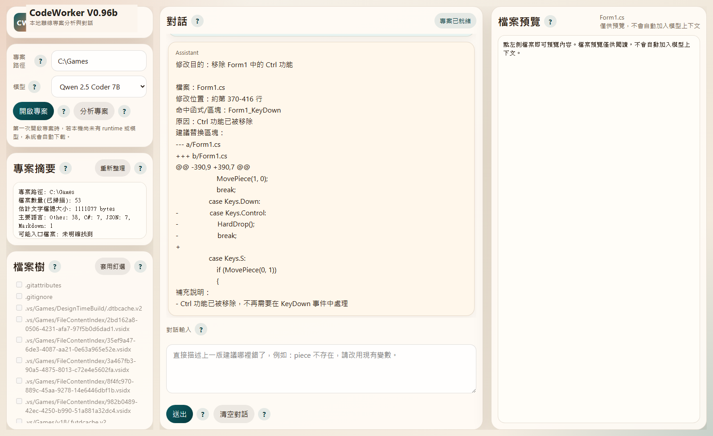
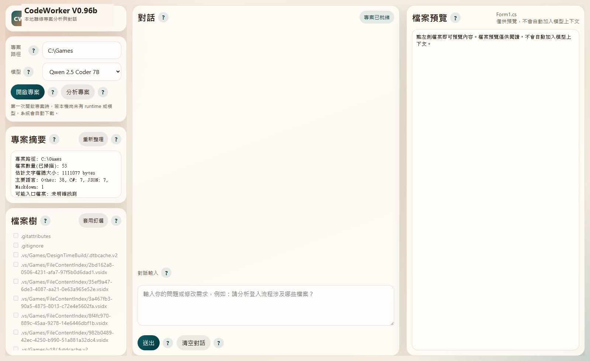

# CodeWorker V0.96b

> A privacy-first, offline AI code assistant for Windows, built for local LLM workflows and USB portable deployment.

[繁體中文](README.zh-TW.md) | [Landing page](README.md)

`CodeWorker` packages `llama.cpp`, `WinPython`, `PortableGit`, GGUF models, and a local Web UI into a portable workspace. It is designed for:

- **offline AI**
- **local LLM**
- **USB portable**
- **secure code analysis**
- **on-premise**
- **air-gapped environment**
- **privacy-first** development

---

## 1. System Requirements

- Windows 10 / 11 x64
- 16GB RAM recommended
- AVX2-capable CPU recommended
- Internet access is required for the first runtime / model download
- The initial download is **over 5GB**, so expect some waiting time depending on network speed and USB / disk write speed
- Enabling `Gemma 4 E4B` increases initial download size and disk usage further
- After setup completes, the tool can run offline

---

## 2. Model Positioning

- `Qwen 2.5 Coder 7B`
  - default model
  - currently the most stable option
- `Gemma 4 E4B`
  - optional evaluation model
  - validated for the `llama.cpp + GGUF + Windows local + USB` architecture
  - can start and localize target code regions, but is still less stable than `Qwen` for edit suggestions

---

## 3. Installation

### Full bootstrap

```cmd
scripts\bootstrap.cmd
```

This prepares:

- `llama.cpp`
- `PortableGit`
- `WinPython`
- default model files

### Optional CLI agent setup

```cmd
scripts\install-aider.cmd
```

---

## 4. Quick Start

### Launch the Web UI

```cmd
scripts\launch-webui.cmd
```

Then open:

```text
http://127.0.0.1:8764
```

### Web UI screenshots





---

## 5. Web UI Workflow

1. Click the project path field and choose the project root
2. Confirm the model selection
3. Click `Open project`
4. Check the files you want in the file tree
5. Click `Apply pins`
6. Ask questions or describe change requests in the main chat

### Important context rules

- `File preview` is read-only and **does not** automatically become model context
- The model only answers from the **applied pinned files**
- If the last suggestion is wrong, continue in the same main chat and explain what is wrong

---

## 6. Main Web UI Features

### Project path

- Chooses the project root
- Clicking the input opens the native Windows folder picker

### Model

- Switches the local model for the current session
- Reopen the project after changing the model

### Response behavior

- Main chat and `Analyze project` now stay closer to the model's original output
- The system no longer applies heavy reply cleanup or style compression
- Answers still use only the **applied pinned files** as trusted context

### Open project

- validates the path
- prepares the Git workspace
- starts the local model
- scans files, entry points, and test locations

### Project summary

- shows project path, file count, major languages, likely entry points, and test locations
- also shows the currently applied pinned files

### File tree

- the only place where model context is selected
- check files, then click `Apply pins`

### File preview

- read-only preview
- helps you inspect a single file before deciding whether to pin it

### Chat

- all analysis, explanation, and iterative code-suggestion work happens in the main chat panel

---

## 7. CLI Usage

### Start the local model server

```cmd
scripts\start-server.cmd
```

Switch model:

```cmd
scripts\start-server.cmd gemma4
```

### Start project-level chat

```cmd
scripts\code-chat.cmd C:\path\to\project
```

Use Gemma 4:

```cmd
scripts\code-chat.cmd C:\path\to\project gemma4
```

---

## 8. Typical Use Cases

- understanding a codebase in an offline or air-gapped environment
- secure code analysis where source code cannot leave the machine
- carrying a USB portable AI assistant to multiple Windows machines
- evaluating `Qwen` and `Gemma 4 E4B` side by side on the same pinned files

---

## 9. Version History

### V0.96b

- updated the Web UI and README version strings to `V0.96b`
- aligned main chat and `Analyze project` with a response flow closer to the models' original output
- synchronized the landing page and bilingual docs with the current model positioning and response behavior

### V0.95b

- promoted the repo state at that time to a formal `V0.95b` baseline
- added the README landing page plus split `README.zh-TW.md` and `README.en.md`
- added a full `繁中 / EN` language switch to the Web UI

### V0.94b

- removed the edit-plan modal
- moved all analysis and suggestion iterations back into the main chat
- added `Gemma 4 E4B` as an evaluation model

---

## 10. Important Notes

- `Qwen 2.5 Coder 7B` remains the default model
- `Gemma 4 E4B` is an evaluation model, not the recommended default
- If you need more reliable structured edit suggestions, `Qwen` is still the safer option

---

## 11. Known Limitations

- Windows-first workflow
- large first-time download size
- `Gemma 4 E4B` is still weaker than `Qwen` for structured code-edit suggestions

---

## 12. License

[MIT](LICENSE)
