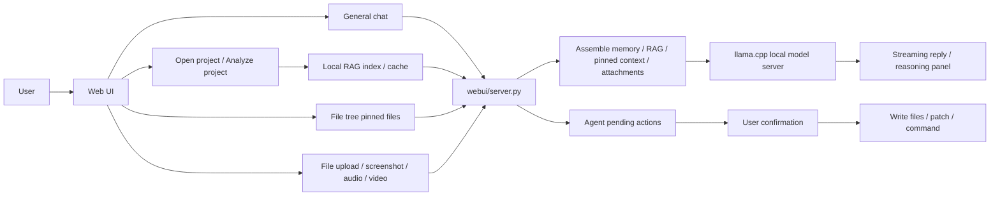

# CodeWorker V1.00.000

> A privacy-first offline Windows code assistant built around local LLM workflows.

[README 首頁](README.md) | [繁體中文](README.zh-TW.md)

---

## 1. Features

`CodeWorker` packages `llama.cpp`, `WinPython`, `PortableGit`, GGUF models, and a local Web UI into one Windows workspace. It is meant for projects where source code cannot be uploaded, cloud models cannot be used, or the tool must be carried to a customer machine on USB or an external drive.

Core capabilities:

- Local model service: `Gemma 4 26B` is the default model and is served by CodeWorker's bundled `llama.cpp` service. Ollama is not required.
- Backup model: `Qwen 3.5 9B Vision` remains available as an optional model.
- General chat: you can ask normal questions before opening a project, and no project data is sent.
- Full-project retrieval: after a project is opened, chat can use the local RAG index to find relevant files and snippets even when no files are pinned.
- Focused context: checked files in the `File tree` become pinned context and take priority over broad project retrieval.
- File attachments: code, config, documents, images, audio, and video can be attached. CodeWorker sends extracted text, keyframes, or transcripts when available, otherwise it falls back to metadata.
- Long answers and memory: streaming replies support automatic continuation, partial-output history, compressed conversation memory, and recent raw turns for follow-up questions.
- Agent safety: writes, patches, deletes, and commands become pending actions and only run after user confirmation.

Current model positioning:

- `Gemma 4 26B`
  - default primary model
  - uses Unsloth GGUF with bundled `llama.cpp`
  - if `mmproj` is available, images and video keyframes use native vision; otherwise CodeWorker sends text, transcript, or metadata fallback
- `Qwen 3.5 9B Vision`
  - optional backup model
  - useful for text, image, project Q&A, and screenshot understanding

---

## 2. Important Notes

- The first run needs internet access to download runtimes and models; later use can be offline.
- Reserve enough disk space and memory around the `32GB RAM` class when possible. Actual performance depends on GPU, integrated graphics memory sharing, and the selected quantization file.
- CodeWorker does not depend on Ollama; models are served by the bundled `llama.cpp` service.
- Without an opened project, chat behaves as normal Q&A. With an opened project and no pinned files, chat uses full-project RAG. With pinned files, pinned context takes priority.
- Attachments are best-effort: CodeWorker tries native model payload first, then text extraction, video keyframes, speech transcript, or metadata fallback.
- Agent writes, patches, deletes, and commands require user confirmation and are written to the audit log.

---

## 3. Installation

### First full bootstrap

```cmd
scripts\bootstrap.cmd
```

This prepares the components defined in `config\bootstrap.manifest.json`:

- `llama.cpp`
- `WinPython`
- `PortableGit`
- `FFmpeg`
- `whisper.cpp` runtime when enabled by the manifest
- default models and `mmproj`

### Launch the Web UI

```cmd
scripts\launch-webui.cmd
```

Open:

```text
http://127.0.0.1:8764
```

### Optional CLI agent setup

```cmd
scripts\install-aider.cmd
```

---

## 4. Usage and Tutorial

### Screenshot


### General Q&A

1. Launch the Web UI.
2. Ask directly in the main chat without opening a project.
3. This mode does not add `PROJECT RAG CONTEXT`, pinned files, or file tree data.

### Project search and Q&A

1. Choose the project root in `Project path`.
2. Click `Open project`.
3. Click `Analyze project` when you want CodeWorker to build or refresh the index.
4. Ask about file locations, flows, changes, or errors. If no files are pinned, CodeWorker uses full-project RAG.
5. Check file names in the `File tree` to focus the model on specific files. The checked state syncs immediately as pinned context.

Suggested prompts:

- `Where is the code that loads the model? Include file path, section, and why.`
- `How should I change the game speed? List file paths, line ranges, and reasons.`
- `Which files are likely related to this error?`
- `Explain the login flow based on the current project.`

### File attachment analysis

1. Click `Attach file`, or paste a screenshot into the chat input.
2. You can attach code, config, documents, images, audio, and video.
3. Text and code are extracted when possible. PDF / DOCX text is extracted when the local extractor is available.
4. Images try native vision first. Videos try `FFmpeg` keyframe extraction first. Audio files and video audio tracks try speech-to-text first.
5. If the local extractor is missing or the model cannot receive a modality, CodeWorker sends metadata and a limitation note instead of pretending the content was seen.

### Long answers and follow-ups

- Reasoning is collapsed by default and can be expanded fully. When expanded, it auto-scrolls to the latest output.
- If the model stops because of `finish_reason=length`, CodeWorker continues from the previous answer tail instead of resending large RAG context.
- If streaming fails mid-answer, the partial output is kept in history so a manual "continue" can resume.
- Older turns are compressed into a memory summary, while recent turns remain raw to preserve follow-up context and reduce token use.

---

## 5. File Structure

```text
CodeWorker/
├─ config/        # bootstrap, model registry, and aider settings
├─ data/          # RAG indexes, Agent audit log, and local state
├─ docs/          # screenshots, internal docs, and test notes
├─ downloads/     # bootstrap download cache
├─ logs/          # Web UI and model server logs
├─ models/        # GGUF models and mmproj
├─ runtime/       # WinPython, PortableGit, llama.cpp, FFmpeg, whisper.cpp
├─ scripts/       # bootstrap, model resolution, server launch, and regression tests
├─ webui/         # Python backend, RAG/Agent modules, and frontend assets
├─ README.md
├─ README.zh-TW.md
└─ README.en.md
```

Key files:

- `config\bootstrap.manifest.json`: runtime, model source, model path, `mmproj`, and defaults.
- `scripts\resolve_model_env.py`: resolves model file, port, context, and `mmproj` from the manifest.
- `scripts\launch_llama_server.py`: launches the bundled `llama.cpp` model server.
- `scripts\launch-webui.cmd`: starts the Web UI.
- `scripts\run_webui_regression.py`: Web UI, attachment, and RAG regression tests.
- `webui\server.py`: API routes, streaming chat, context assembly, attachment handling, memory, and model calls.
- `webui\core\models.py`: model registry, status, health checks, and OpenAI-compatible endpoint data.
- `webui\rag\index.py`: hierarchical project index, SQLite FTS5 fallback, chunk search, and impact hints.
- `webui\agent\runtime.py`: ReAct-style Agent, tool calls, pending actions, and audit log.
- `webui\static\app.js`: frontend chat, streaming, attachments, file tree, and model switching.
- `webui\static\styles.css`: 450px sidebar and single-column chat layout.

---

## 6. Workflow Architecture



Workflow rules:

- Without an opened project, the chat payload only contains the user question, attachments, and conversation memory.
- With an opened project and no pinned files, the RAG index searches paths, symbols, summaries, and chunks based on the question.
- With pinned files, pinned context takes priority so unrelated project content is not mixed in.
- Attachments use native multimodal payload first, then extractor or metadata fallback.
- Long-answer continuation uses the previous answer tail and avoids resending large `PROJECT RAG CONTEXT`.
- The Agent can read and search directly. Write and command actions require pending confirmation.

---

## 7. Version History

### V1.00.000

- changed the default model to `Gemma 4 26B`; `Qwen 3.5 9B Vision` remains available as an optional backup model.
- moved Gemma4 to Unsloth GGUF with bundled `llama.cpp`, and validates the live `model_path` plus vision `mmproj` state.
- added full-project RAG search so opened projects can be searched for relevant files, snippets, and line ranges without pinned files.
- strengthened Chinese query expansion for natural-language code location questions such as game speed and model loading.
- added universal attachment handling: document text extraction, image native vision, video keyframes, audio / video speech-to-text, and metadata fallback.
- added bundled `FFmpeg` and `whisper.cpp` speech-to-text pipeline.
- added compressed conversation memory plus recent raw turns to improve follow-up questions while reducing token use.
- fixed long-answer truncation and manual continuation: automatic continuation sends only the answer tail, and streaming failures keep partial output.
- changed reasoning to collapsed-by-default with auto-scroll when expanded.
- removed the right-side file preview panel and moved to a 450px sidebar with a single-column chat workspace.
- changed Agent write, patch, delete, and command actions to pending action + confirmation + audit log.
- refreshed README, workflow diagrams, file structure, and usage guidance for V1.00.000.

### V0.98b

- updated `Gemma 4` from E4B to 26B GGUF, served by CodeWorker's bundled `llama.cpp` service without Ollama.
- removed the project/pinned-file requirement for general chat.
- added `/api/chat/stream` with streaming content and reasoning/thinking display.
- added local RAG index, Agent v1 APIs, pending action confirmation, and audit logging.
- replaced `Qwen 2.5` with `Qwen 3.5` as the default model at that time; starting from `V1.00.000`, the default model is `Gemma 4 26B`.
- merged attachment hints and controls, and added `context coverage`.

### V0.97b

- aligned main chat and `Analyze project` with a more raw-first response path.
- fixed large pinned-file cases that could degrade to filename-only context.
- refreshed the bilingual README screenshots.

### V0.96b

- aligned the landing page, bilingual docs, and Web UI positioning.
- moved responses closer to the models' original output.

### V0.95b

- added the README landing page and split bilingual docs.
- added `繁中 / EN` language switching in the Web UI.

### V0.94b

- removed the old edit-plan modal.
- moved analysis and suggestion iterations back into the main chat.

---

## 8. Copyright and License

This project is licensed under [MIT](LICENSE).

If you use CodeWorker inside customer environments or air-gapped networks, you should still verify:

- the licenses of the local models and third-party runtimes.
- local rules for USB tools, portable software, and offline AI.
- whether the target project data is allowed to be read by a local model.
