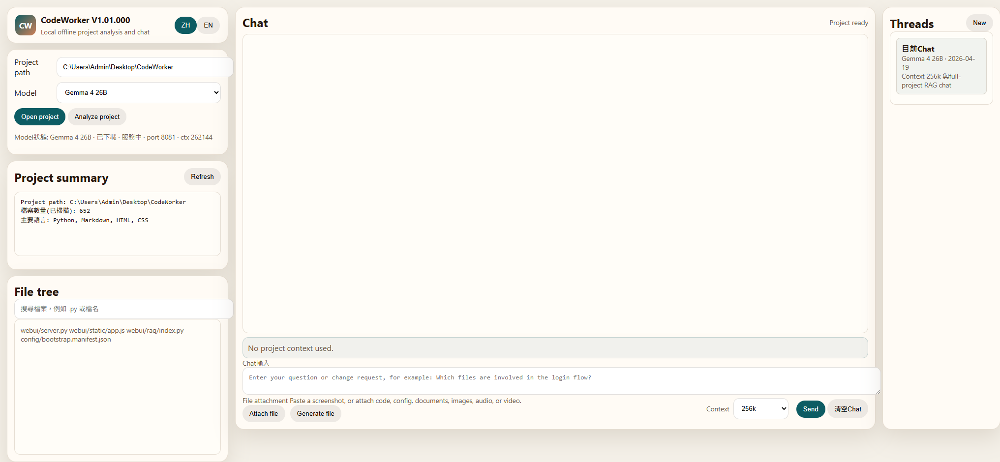
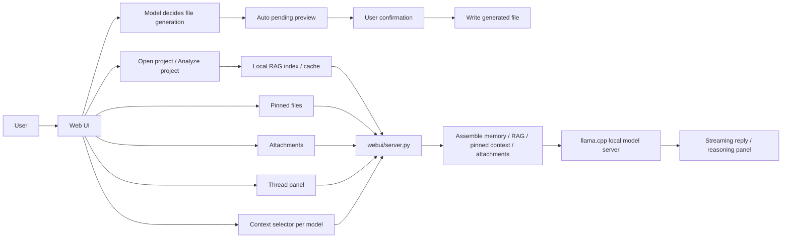

# CodeWorker V1.01.000

> A privacy-first offline Windows code assistant built around local LLM workflows.

[README 首頁](README.md) | [繁體中文](README.zh-TW.md)

---

## 1. Features

`CodeWorker` packages `llama.cpp`, `WinPython`, `PortableGit`, GGUF models, and a local Web UI into one Windows workspace. It is intended for projects where source code cannot be uploaded, cloud models cannot be used, or the assistant must run inside customer, intranet, or air-gapped environments.

Core capabilities:

- Local model service: `Gemma 4 26B` is the default model and is served by CodeWorker's bundled `llama.cpp` service. Ollama is not required.
- Optional model: `Qwen 3.5 9B Vision` remains available, and both models use the same chat, RAG, attachment, and safety flows.
- Context selector: each model remembers its own `4k / 8k / 16k / 32k / 64k / 128k / 256k` context choice. The default is `256k`.
- Full-project retrieval: once a project is opened, chat can use the local RAG index to search paths, symbols, summaries, and chunks even when no files are pinned.
- Focused context: checked files in the `File tree` become pinned context and take priority over broad RAG.
- Attachments: code, config, documents, images, audio, and video can be attached. CodeWorker sends extracted text, keyframes, or transcripts when available, otherwise metadata fallback.
- Threads: the right `240px` thread panel can create, switch, rename, and delete conversations. Each thread keeps its own history and memory.
- Model-driven file generation: ask for a document in normal chat. The model produces the content and title, CodeWorker uses the title to name the file, creates a pending preview, and only writes `.txt/.md/.py/.js/.ts/.json/.html/.css/.yaml/.sql/.cs/.docx/.pdf/.pptx/.xlsx` after confirmation.
- Agent safety: writes, patches, deletes, and commands become pending actions and only run after user confirmation.

---

## 2. Important Notes

- The first run needs internet access to download runtimes and models; later use can be offline.
- `256k` context is an available upper option, not a guarantee that every machine can run it stably. If startup fails, the UI shows the error and log path instead of silently downgrading.
- `32GB RAM` class memory is recommended. Large context, images, video keyframes, and long answers increase memory pressure.
- Without an opened project, chat behaves as normal Q&A. With an opened project and no pinned files, chat uses full-project RAG. With pinned files, pinned context takes priority.
- Videos are analyzed through `FFmpeg` keyframes, not by sending raw MP4 binaries to the model. Audio and video audio tracks try `whisper.cpp` speech-to-text.
- File generation and Agent writes require confirmation before touching the project root. After a file is written, the UI shows the final path and filename.

---

## 3. Installation

### First full bootstrap

```cmd
scripts\bootstrap.cmd
```

This prepares the components defined in `config\bootstrap.manifest.json`:

- `llama.cpp`
- `WinPython`
- `PortableGit`
- `FFmpeg`
- `whisper.cpp` plus the speech-to-text model
- `Gemma 4 26B` / `Qwen 3.5 9B Vision` GGUF files and `mmproj`
- Python document packages: `pypdf`, `pdfplumber`, `python-docx`, `reportlab`, `python-pptx`, `openpyxl`

### Launch the Web UI

```cmd
scripts\launch-webui.cmd
```

Open:

```text
http://127.0.0.1:8764
```

### Optional CLI agent setup

```cmd
scripts\install-aider.cmd
```

---

## 4. Usage and Tutorial

### Screenshot



### General Q&A

1. Launch the Web UI.
2. Ask directly in the main chat without opening a project.
3. This mode does not add `PROJECT RAG CONTEXT`, pinned files, or file tree data.

### Project search and Q&A

1. Choose the project root in `Project path`.
2. Click `Open project`.
3. Click `Analyze project` when the cache should be rebuilt.
4. Ask where code lives, which files matter, or how to change a behavior. Without pinned files, CodeWorker searches the whole project through RAG.
5. Check file names in the `File tree` when you want focused context.

Suggested prompts:

- `Where is the code that loads the model? Include file path and why.`
- `How should I change the game speed? List file paths and reasons.`
- `I want to add online multiplayer. Which files should I modify first?`

### Context Settings

1. Use the `Context` dropdown at the bottom of the chat input.
2. Each model remembers its own selected context.
3. If the running `llama-server` context is lower than the selected value, the next model startup uses the new context.
4. If `256k` fails locally, inspect the left error panel and `logs/llama-server-*.err.log`.

### Threads

- The right `Threads` panel can create, switch, rename, and delete conversations.
- Each thread stores `history`, `memory_summary`, `modelKey`, and `projectPath`.
- `Clear chat` only clears the current thread.

### Attachment Analysis

1. Click `Attach file`, or paste a screenshot into the chat input.
2. You can attach code, config, PDF, DOCX, images, audio, and video.
3. Images try native vision first. Videos extract keyframes first. Audio tries speech-to-text.
4. If extraction or native payload fails, CodeWorker sends metadata and a limitation note instead of pretending the content was seen.

### File Generation

1. Open a project.
2. Ask in normal chat, for example: `Generate a project feature introduction PPT file.`
3. The model first writes the document content. Its first heading is used as the automatic filename source, and CodeWorker creates a pending preview from that reply.
4. To export the previous assistant answer, write: `Turn the previous explanation and use cases into PPTX and PDF files.` or `Generate a Word document from the explanation.`
5. If one request mentions multiple formats, CodeWorker creates multiple pending previews, such as one `.pptx` and one `.pdf`.
6. For Word, mention `Word`, `word file`, `docx`, or `docx file`, for example: `Generate a Word file from the previous answer.`
7. For text and code, mention the extension or format alias, such as `txt file`, `md file`, `py file`, `js file`, `json file`, `html file`, `css file`, `yaml file`, `sql file`, or `cs file`.
8. For Excel, mention `Excel`, `xlsx`, `spreadsheet`, or the target extension, for example: `Turn the test checklist into an Excel spreadsheet.`
9. Review the pending preview and click `Confirm write`. After writing, the chat shows the final path and filename.

---

## 5. File Structure

```text
CodeWorker/
├─ config/        # bootstrap, model registry, and aider settings
├─ data/          # RAG indexes, chat threads, model context choices, and audit log
├─ docs/          # screenshots, internal docs, and test notes
├─ downloads/     # bootstrap download cache
├─ logs/          # Web UI, model server, and context bench logs
├─ models/        # GGUF models and mmproj
├─ runtime/       # WinPython, PortableGit, llama.cpp, FFmpeg, whisper.cpp
├─ scripts/       # bootstrap, model resolution, server launch, and regression tests
├─ webui/         # Python backend, RAG/Agent modules, and frontend assets
├─ README.md
├─ README.zh-TW.md
└─ README.en.md
```

Key files:

- `config\bootstrap.manifest.json`: runtime, model sources, `contextWindow`, KV cache type, `mmproj`, and defaults.
- `scripts\resolve_model_env.py`: resolves model file, port, context, KV cache type, and `mmproj` from the manifest.
- `scripts\launch_llama_server.py`: launches the bundled `llama.cpp` model server.
- `scripts\run_webui_regression.py`: regression tests for Web UI, attachments, RAG, and streaming.
- `webui\server.py`: API routes, streaming chat, context assembly, threads, file generation, attachment handling, memory, and model calls.
- `webui\core\models.py`: model registry, status, and OpenAI-compatible endpoint data.
- `webui\rag\index.py`: hierarchical project index, SQLite FTS5 fallback, chunk search, and impact hints.
- `webui\agent\runtime.py`: ReAct-style Agent, tool calls, pending actions, and audit log.
- `webui\static\app.js`: frontend chat, context dropdown, threads, attachments, file tree, and streaming.
- `webui\static\styles.css`: 450px sidebar, main chat, and 240px thread panel.

---

## 6. Workflow Architecture



Workflow rules:

- Without an opened project, the chat payload only contains the user question, attachments, and conversation memory.
- With an opened project and no pinned files, RAG searches paths, symbols, summaries, and chunks.
- With pinned files, pinned context takes priority.
- Long-answer continuation uses the previous answer tail instead of resending large `PROJECT RAG CONTEXT`.
- File generation is triggered through normal chat. The model first produces content and a title, then CodeWorker creates the pending preview. Multi-format requests create multiple previews. Document outputs clean Markdown markers and use a CJK-capable PDF font.

---

## 7. Version History

### V1.01.000

- added a per-model `Context` dropdown with fixed `4k / 8k / 16k / 32k / 64k / 128k / 256k` options.
- changed the default context for `Gemma 4 26B` and `Qwen 3.5 9B Vision` to `256k`, launched as `llama-server -c 262144`.
- added KV cache type settings with `cacheTypeK=q4_0` and `cacheTypeV=q4_0`.
- added the right `240px` thread panel with create, switch, rename, and delete operations.
- added the file generation pending workflow for text/code, `.docx`, `.pdf`, `.pptx`, and `.xlsx`.
- removed the frontend `Generate file` button. File generation is now detected and initiated from normal model chat.
- changed generated filenames to use the model reply's first Markdown H1 heading, and shows the final path after writing.
- fixed prompts such as `Generate a Word file from the previous answer` being misclassified as continuation; Word generation now creates a `.docx` pending preview.
- expanded text and code aliases, including `txt file`, `md file`, `py file`, `js file`, `ts file`, `json file`, `html file`, `css file`, `yaml file`, `sql file`, and `cs file`.
- added parsing for multi-format generation requests such as `PPTX and PDF`, and previous-answer export when the prompt references `previous` or `last answer`.
- fixed garbled Chinese text in generated PDFs, raw Markdown markers in PPTX / DOCX, and Word generation prompts that should use the previous answer.
- added `pdfplumber`, `reportlab`, `python-pptx`, and `openpyxl` to `scripts\bootstrap.ps1`.
- refreshed README, workflow diagrams, file structure, and usage guidance for V1.01.000.

### V1.00.000

- changed the default model to `Gemma 4 26B`; `Qwen 3.5 9B Vision` remains available as an optional backup model.
- moved Gemma4 to Unsloth GGUF with bundled `llama.cpp`, and validates the live `model_path` plus vision `mmproj` state.
- added full-project RAG search so opened projects can be searched without pinned files.
- added universal attachment handling: document text extraction, native image vision, video keyframes, audio/video speech-to-text, and metadata fallback.
- added compressed conversation memory plus recent raw turns to improve follow-up questions while reducing token use.
- fixed long-answer truncation and manual continuation.
- changed reasoning to collapsed-by-default with auto-scroll when expanded.
- removed the right-side file preview panel and moved to a 450px sidebar with a single-column chat workspace.

### V0.98b

- updated `Gemma 4` from E4B to 26B GGUF, served by CodeWorker's bundled `llama.cpp` service without Ollama.
- removed the project/pinned-file requirement for general chat.
- added `/api/chat/stream` with streaming content and reasoning/thinking display.
- added local RAG index, Agent v1 APIs, pending action confirmation, and audit logging.

### V0.97b

- aligned main chat and `Analyze project` with a more raw-first response path.
- fixed large pinned-file cases that could degrade to filename-only context.

### V0.96b

- aligned the landing page, bilingual docs, and Web UI positioning.

### V0.95b

- added the README landing page and split bilingual docs.
- added `繁中 / EN` language switching in the Web UI.

### V0.94b

- removed the old edit-plan modal.
- moved analysis and suggestion iterations back into the main chat.

---

## 8. Copyright and License

This project is licensed under [MIT](LICENSE).

If you use CodeWorker inside customer environments or air-gapped networks, verify:

- the licenses of local models and third-party runtimes.
- local rules for USB tools, portable software, and offline AI.
- whether target project data is allowed to be read by a local model.
