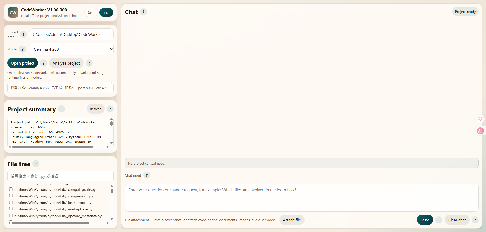
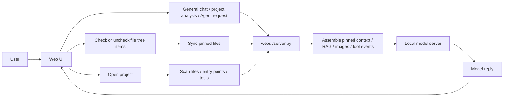

# CodeWorker V1.00.000

> A privacy-first offline Windows code assistant built around local LLM workflows.

[README 首頁](README.md) | [繁體中文](README.zh-TW.md)

---

## 1. Features

`CodeWorker` packages `llama.cpp`, `WinPython`, `PortableGit`, GGUF models, and a local Web UI into one portable workspace for Windows. It is designed for:

- offline or air-gapped environments
- source code that cannot leave the machine
- privacy-first local project analysis
- USB portable on-site support workflows

Current model positioning:

- `Gemma 4 26B`
  - default primary model
  - served by CodeWorker's bundled `llama.cpp` service, with no Ollama dependency
  - defaults to the Unsloth `UD-Q4_K_M` GGUF; if `mmproj` is available, images use native vision, otherwise they are downgraded to text attachment status so the model can explain the limitation
- `Qwen 3.5 9B Vision`
  - optional backup model
  - supports both text and image input
  - can be used for project analysis, code explanation, and screenshot understanding

---

## 2. Important Notes

- `32GB RAM` is the more reliable target, but it is **not** a hard execution gate
- integrated graphics can reduce the RAM actually available to the model
- the first runtime / model download requires internet access; `Gemma 4 26B UD-Q4_K_M` is roughly in the `17GB` class, depending on the selected Hugging Face GGUF file
- the new default two-model layout is significantly larger than the older **11.6 GB** layout, so reserve enough disk space
- older upgraded workspaces can still stay near **16.6 GB** if the removed `qwen25` files are still present
- general chat no longer requires opening a project or pinning files; without project context it behaves as normal Q&A
- the `File tree` can manually pin focused context; when nothing is pinned and a project is open, normal chat uses the full-project search cache and RAG
- project analysis, edit suggestions, RAG, and Agent actions use the opened project and index content
- RAG prioritizes real source code chunks, file paths, and line ranges; for questions such as "which file", "which section", or "how should I change this", README / summary hits are ranked lower
- small-to-medium pinned code sets are sent as full files where possible; if CodeWorker has to fall back to excerpts, the UI shows `context coverage`
- image and attachment requests are attempted with the current model first; if the selected model or `llama.cpp` setup cannot process them, CodeWorker downgrades the attachment into a text note and lets the model explain the limitation
- chat now uses streaming output; `reasoning_content` or `<think>` blocks are preserved in an expandable reasoning panel that auto-scrolls when opened
- normal chat includes compressed memory plus recent raw turns, so follow-up questions such as "the previous one" or "that file" remain connected while using fewer tokens
- when long answers hit `finish_reason=length`, continuation only sends the previous answer tail instead of resending large RAG context; if streaming fails mid-answer, the partial output is saved for manual continuation

Recommended GitHub About:

- Description: `離線 Windows 本地 LLM 程式碼助理，支援 Gemma 4 26B、全專案 RAG、附件分析與隱私優先的本機專案理解。`
- Topics: `offline-ai`, `local-llm`, `windows`, `code-assistant`, `privacy-first`, `llama-cpp`

---

## 3. Installation

### Full bootstrap

```cmd
scripts\bootstrap.cmd
```

This prepares:

- `llama.cpp`
- `PortableGit`
- `WinPython`
- default model files

### Optional CLI agent setup

```cmd
scripts\install-aider.cmd
```

---

## 4. Usage and Tutorial

### Launch the Web UI

```cmd
scripts\launch-webui.cmd
```

Open:

```text
http://127.0.0.1:8764
```

### Screenshot



### Basic workflow

1. Choose the project root in `Project path`
2. Confirm the model selection
3. Click `Open project`
4. When project context is needed, check files in the `File tree`
5. The pinned state syncs immediately when you check or uncheck files
6. Ask questions or describe changes in the main chat; you can also ask general questions before opening a project

### File attachment workflow

1. Click `Attach file`, or paste a screenshot into the chat box
2. If the current model supports images, the request uses that model directly
3. If the current model does not support images, CodeWorker converts the attachment state into a text note and lets the model answer with the limitation
4. Larger screenshots are automatically downscaled; models with a usable vision projection can receive the image directly

### Suggested tutorial prompts

- `Please explain the project entry flow.`
- `Compare Program.cs, Form1.cs, and AudioManager.cs.`
- `How should I change the game speed? Please list file paths, line ranges, and reasons.`
- `Explain this API based on the pinned files.`
- `Read this screenshot and summarize the code behavior.`

---

## 5. File Structure

```text
CodeWorker/
├─ config/        # bootstrap, model, and aider settings
├─ docs/          # screenshots and internal docs
├─ downloads/     # first-run download cache
├─ logs/          # runtime logs
├─ models/        # GGUF models and mmproj
├─ runtime/       # WinPython, PortableGit, llama.cpp
├─ scripts/       # bootstrap, model server, Web UI, and CLI entry scripts
├─ webui/         # Python backend, RAG/Agent modules, and static frontend assets
├─ README.md
├─ README.zh-TW.md
└─ README.en.md
```

Key files:

- `webui/server.py`: API routes, streaming chat, context assembly, image preprocessing, model calls
- `webui/core/models.py`: model registry, manifest parsing, model capability and status data
- `webui/rag/index.py`: local hierarchical RAG index, SQLite FTS5 fallback, impact analysis
- `webui/agent/runtime.py`: ReAct-style Agent v1, controlled tool calls, pending actions, audit log
- `webui/static/app.js`: frontend chat flow, instant pin sync, file attachments
- `webui/static/styles.css`: layout and bilingual UI styling
- `scripts\start-server.cmd`: local model server entry
- `scripts\code-chat.cmd`: project-level CLI chat entry
- `config\bootstrap.manifest.json`: bootstrap and default-model configuration

---

## 6. Workflow Architecture



Behavior summary:

- `Open project` prepares the workspace and scans metadata, but does not send the whole project to the model
- the `File tree` is the manual context-selection entry point; when nothing is pinned, the RAG index automatically provides retrieval-based context
- images go through the backend together with the text request, then are either handled directly or downgraded into a text attachment note
- when the context budget is too small for full files, the UI explicitly shows excerpt mode through `context coverage`
- older turns are compressed into `COMPRESSED CONVERSATION MEMORY`, while the latest turns stay raw; if memory conflicts with the current RAG / pinned context, the current project context wins
- automatic long-answer continuation uses the previous answer tail, avoiding repeated submission of the same large `PROJECT RAG CONTEXT`
- write, patch, delete, and command Agent actions must become pending actions first; they only run after user confirmation, and the audit log is written to `data/agent-actions.jsonl`

---

## 7. Version History

### V1.00.000

- changed the default model to `Gemma 4 26B`; `Qwen 3.5 9B Vision` remains available as a backup model
- added a bundled FFmpeg runtime so uploaded videos can be converted into hardware-budgeted keyframes for image-capable model analysis
- added a bundled `whisper.cpp` speech-to-text pipeline for audio files and video audio tracks; when no local STT backend is available, the UI and prompt expose an explicit status
- removed the right-side file preview panel and changed the chat workspace to a wider single-column layout; clicking a filename in the file tree now toggles pinned context
- fixed long-answer continuation so reasoning-only responses trigger an answer-only retry, and user "continue" requests reuse recent chat history instead of re-injecting full-project RAG
- added compressed conversation memory for normal chat: all models receive older-turn summaries plus recent raw turns to improve follow-ups while saving tokens
- fixed manual continuation after streaming failures: partial output is stored in history, so the next "continue" request does not re-inject full-project RAG
- strengthened RAG code location: Chinese queries expand common implementation terms, so "game speed" searches for `speed`, `Timer`, `Interval`, `Tick`, and `gameSpeed`
- reasoning panels now auto-scroll to the newest streamed text when expanded
- tightened video metadata-only fallback so the model must not infer content from file names, URLs, or metadata
- strengthened Gemma4 startup checks by validating the live `model_path` and vision `mmproj` state before treating a server as ready
- cleaned up obsolete Gemma4 model directories while keeping the active Unsloth `UD-Q4_K_M` model and Qwen backup model

### V0.98b

- updated `Gemma 4` from E4B to 26B GGUF, served by CodeWorker's bundled `llama.cpp` service without Ollama
- removed the project/pinned-file requirement for general chat
- added `/api/chat/stream` with full streaming content and reasoning/thinking display
- added local RAG index, Agent v1 APIs, pending action confirmation, and audit logging
- replaced `Qwen 2.5` with `Qwen 3.5` as the default model at that time; starting from `V1.00.000`, the default model is `Gemma 4 26B`
- merged the file attachment hint and `Attach file` / `Remove attachments` controls into the same row
- increased the pinned-file context budget so small projects are more likely to use full files
- added `context coverage` to show whether the model received full files or excerpts
- updated the README to reflect the two-model layout, the `11.6 GB / 16.6 GB` storage note, and the latest multimodal behavior

### V0.97b

- aligned main chat and `Analyze project` with a more raw-first response path
- fixed large pinned-file cases that could degrade to filename-only context
- refreshed the bilingual README screenshots

### V0.96b

- aligned the landing page, bilingual docs, and Web UI positioning
- moved responses closer to the models' original output

### V0.95b

- added the README landing page and split bilingual docs
- added `繁中 / EN` language switching in the Web UI

### V0.94b

- removed the old edit-plan modal
- moved analysis and suggestion iterations back into the main chat

---

## 8. Copyright and License

This project is licensed under [MIT](LICENSE).

If you use CodeWorker inside customer environments or air-gapped networks, you should still verify:

- the licenses of the local models and bundled runtimes
- local rules for USB tools and offline AI
- whether the target project data is allowed to be read by a local model
