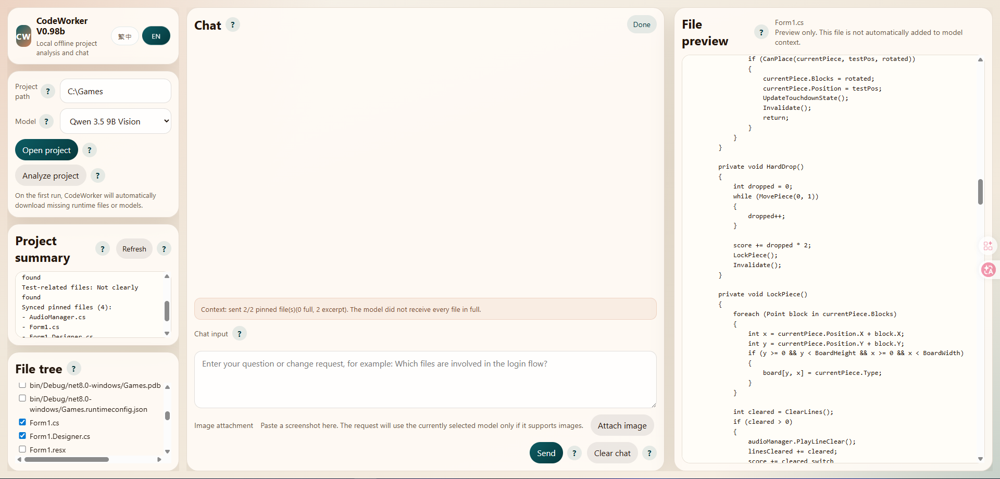
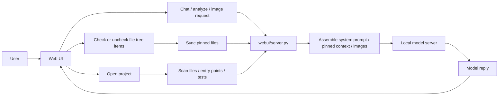

# CodeWorker V0.98b

> A privacy-first offline Windows code assistant built around local LLM workflows.

[README 首頁](README.md) | [繁體中文](README.zh-TW.md)

---

## 1. Features

`CodeWorker` packages `llama.cpp`, `WinPython`, `PortableGit`, GGUF models, and a local Web UI into one portable workspace for Windows. It is designed for:

- offline or air-gapped environments
- source code that cannot leave the machine
- privacy-first local project analysis
- USB portable on-site support workflows

Current model positioning:

- `Qwen 3.5 9B Vision`
  - default and primary model
  - supports both text and image input
  - used for project analysis, code explanation, and screenshot understanding
- `Gemma 4 E4B`
  - secondary model
  - currently treated as a text-analysis model in this project
  - not yet a formally supported image model in the current local `llama.cpp` route

---

## 2. Important Notes

- `32GB RAM` is the more reliable target, but it is **not** a hard execution gate
- integrated graphics can reduce the RAM actually available to the model
- the first runtime / model download requires internet access and is **over 5GB**
- the new default two-model layout is about **11.6 GB**
- older upgraded workspaces can still stay near **16.6 GB** if the removed `qwen25` files are still present
- `File preview` is read-only and does not automatically become model context
- the model answers only from the **synced pinned files**
- `Qwen 3.5` now tries to send small-to-medium pinned code sets as full files; if it has to fall back to excerpts, the UI shows `context coverage`
- image input is currently a formally supported path for `Qwen 3.5 9B Vision`

Recommended GitHub About:

- Description: `離線 Windows 本地 LLM 程式碼助理，支援 Qwen 3.5 圖文分析、釘選檔案上下文與隱私優先的本機專案理解。`
- Topics: `offline-ai`, `local-llm`, `windows`, `code-assistant`, `privacy-first`, `llama-cpp`

---

## 3. Installation

### Full bootstrap

```cmd
scripts\bootstrap.cmd
```

This prepares:

- `llama.cpp`
- `PortableGit`
- `WinPython`
- default model files

### Optional CLI agent setup

```cmd
scripts\install-aider.cmd
```

---

## 4. Usage and Tutorial

### Launch the Web UI

```cmd
scripts\launch-webui.cmd
```

Open:

```text
http://127.0.0.1:8764
```

### Screenshot



### Basic workflow

1. Choose the project root in `Project path`
2. Confirm the model selection
3. Click `Open project`
4. Check files in the `File tree`
5. The pinned state syncs immediately when you check or uncheck files
6. Ask questions or describe changes in the main chat

### Image input workflow

1. Click `Attach image`, or paste a screenshot into the chat box
2. If the current model supports images, the request uses that model directly
3. If the current model does not support images, the UI shows a clear error instead of silently switching models
4. Larger screenshots are automatically downscaled before being sent to `Qwen 3.5`

### Suggested tutorial prompts

- `Please explain the project entry flow.`
- `Compare Program.cs, Form1.cs, and AudioManager.cs.`
- `Explain this API based on the pinned files.`
- `Read this screenshot and summarize the code behavior.`

---

## 5. File Structure

```text
CodeWorker/
├─ config/        # bootstrap, model, and aider settings
├─ docs/          # screenshots and internal docs
├─ downloads/     # first-run download cache
├─ logs/          # runtime logs
├─ models/        # GGUF models and mmproj
├─ runtime/       # WinPython, PortableGit, llama.cpp
├─ scripts/       # bootstrap, model server, Web UI, and CLI entry scripts
├─ webui/         # Python backend and static frontend assets
├─ README.md
├─ README.zh-TW.md
└─ README.en.md
```

Key files:

- `webui/server.py`: API routes, context assembly, image preprocessing, model calls
- `webui/static/app.js`: frontend chat flow, instant pin sync, image attachments
- `webui/static/styles.css`: layout and bilingual UI styling
- `scripts\start-server.cmd`: local model server entry
- `scripts\code-chat.cmd`: project-level CLI chat entry
- `config\bootstrap.manifest.json`: bootstrap and default-model configuration

---

## 6. Workflow Architecture



Behavior summary:

- `Open project` prepares the workspace and scans metadata, but does not send the whole project to the model
- the `File tree` is the only context-selection entry point
- `File preview` is for reading only
- images go through the backend together with the text request
- when the context budget is too small for full files, the UI explicitly shows excerpt mode through `context coverage`

---

## 7. Version History

### V0.98b

- replaced `Qwen 2.5` with `Qwen 3.5` as the default model
- merged the image hint and `Attach image` / `Remove image` controls into the same row
- increased the pinned-file context budget so small projects are more likely to use full files
- added `context coverage` to show whether the model received full files or excerpts
- updated the README to reflect the two-model layout, the `11.6 GB / 16.6 GB` storage note, and the latest multimodal behavior

### V0.97b

- aligned main chat and `Analyze project` with a more raw-first response path
- fixed large pinned-file cases that could degrade to filename-only context
- refreshed the bilingual README screenshots

### V0.96b

- aligned the landing page, bilingual docs, and Web UI positioning
- moved responses closer to the models' original output

### V0.95b

- added the README landing page and split bilingual docs
- added `繁中 / EN` language switching in the Web UI

### V0.94b

- removed the old edit-plan modal
- moved analysis and suggestion iterations back into the main chat

---

## 8. Copyright and License

This project is licensed under [MIT](LICENSE).

If you use CodeWorker inside customer environments or air-gapped networks, you should still verify:

- the licenses of the local models and bundled runtimes
- local rules for USB tools and offline AI
- whether the target project data is allowed to be read by a local model
