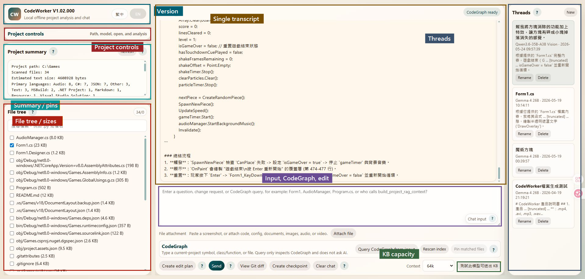
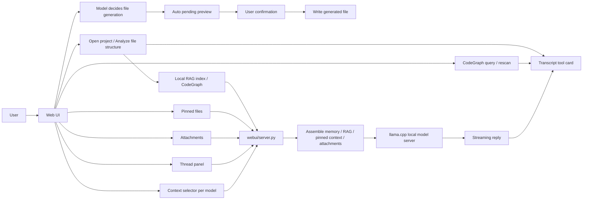

# CodeWorker V1.02.000

> A privacy-first offline Windows code assistant built around local LLM workflows.

[README 首頁](README.md) | [繁體中文](README.zh-TW.md)

---

## 1. Features

`CodeWorker` packages `llama.cpp`, `WinPython`, `PortableGit`, GGUF models, and a local Web UI into one Windows workspace. It is intended for projects where source code cannot be uploaded, cloud models cannot be used, or the assistant must run inside customer, intranet, or air-gapped environments.

Core capabilities:

- Local model service: `Gemma 4 26B` is the initial fallback model, then CodeWorker uses the last successfully used model as the next default. All models are served by the bundled `llama.cpp` service. Ollama is not required.
- Model download progress: large GGUF downloads show percent, downloaded size, and total size so users can tell that the model is still downloading.
- Model catalog: `Gemma 4 26B` and `Qwen 3.5 9B Vision` remain available, with new options for `Qwen3.6-35B-A3B Vision`, `Qwen3-Coder 30B A3B`, `GLM-4.6`, `Qwen2.5-Coder 14B Instruct`, and `DeepSeek-Coder V2 Lite`.
- Hardware auto-optimization: the Web UI detects RAM, CPU, GPU vendor, VRAM, `nvidia-smi`, and Vulkan availability, then recommends a model and applies backend, context, threads, GPU layers, and 8GB NVIDIA MoE offload settings.
- Context selector: each model remembers its own context options from `4k` to `256k`; `GLM-4.6` also exposes a `200k` option.
- Context capacity measurement: the current model can be benchmarked for the KB it can actually receive. Results are stored locally in `data\model-context-calibration.json`, and edit plans prefer the measured `structuredEditChars`.
- Full-file edit context: pinned files and resolver-selected files are sent as complete files when they fit within the measured budget; only then does CodeWorker fall back to full function / class regions and line windows.
- Edit-plan diagnostics: every edit plan reports context coverage. Unsafe model suggestions are shown as `unverified reference snippets` and do not expose apply controls.
- Full-project retrieval: once a project is opened, chat can use the local RAG index to search paths, symbols, summaries, and chunks even when no files are pinned.
- CodeGraph-style semantic index: every RAG rebuild also writes `code_nodes`, `code_edges`, and `code_unresolved_refs` for symbol entry points, imports, calls, extends, and impact navigation.
- File-structure analysis: deterministic multi-language classification finds entrypoints, core source, project config, UI, assets, tests, and ignored outputs before pinning files.
- Single transcript stream: AI replies, file-structure analysis, CodeGraph queries, context coverage, and generated-file confirmations are kept in one scrollable transcript.
- Busy indicators: AI replies, streaming, and edit-plan generation show a spinner / busy bar while the model is still working.
- Codex plugin: `plugins\codeworker-codegraph` can be installed in Codex so agents query the local CodeWorker graph before deciding which files to read.
- Focused context: checked files in the `File tree` become pinned context and take priority over broad RAG.
- Attachments: code, config, documents, images, audio, and video can be attached. CodeWorker sends extracted text, keyframes, or transcripts when available, otherwise metadata fallback.
- Threads: the right `240px` thread panel can create, switch, rename, and delete conversations. Each thread keeps its own history, memory, and transcript.
- Model-driven file generation: ask for a document in normal chat. The model produces the content and title, CodeWorker uses the title to name the file, creates a pending preview, and only writes `.txt/.md/.py/.js/.ts/.json/.html/.css/.yaml/.sql/.cs/.docx/.pdf/.pptx/.xlsx` after confirmation.
- Agent safety: writes, patches, deletes, renames, and commands become pending actions and only run after user confirmation; applying changes creates a pre-edit Git checkpoint and creates a post checkpoint when files changed, so users can inspect diffs and restore the edit.

---

## 2. Important Notes

- The first run needs internet access to download runtimes and models; later use can be offline.
- `Qwen3.6-35B-A3B Vision`, `Qwen3-Coder 30B A3B`, `GLM-4.6`, `Qwen2.5-Coder 14B Instruct`, and `DeepSeek-Coder V2 Lite` are not downloaded during the first bootstrap. They are downloaded only when explicitly selected.
- The `Qwen3.6-35B-A3B Vision` 8GB NVIDIA profile still needs enough system RAM. It chooses `32k` / `64k` context by hardware, uses `q4_0` KV cache, `--n-cpu-moe=999`, `--flash-attn`, `--jinja`, `--batch-size=512`, `--ubatch-size=128`, and the required GPU offload settings, keeping MoE weights in CPU/RAM while CUDA offloads non-MoE layers.
- `Qwen3.6-35B-A3B Vision` can also run in CPU-only mode when no discrete GPU is available, but it needs more system RAM, smaller context, and longer wait times. See `Qwen3.6-35B-A3B CPU-only llama.cpp settings`.
- `256k` context is an available upper option, not a guarantee that every machine can run it stably. If startup fails, the UI shows the error and log path instead of silently downgrading.
- `32GB RAM` class memory is recommended. Large context, images, video keyframes, and long answers increase memory pressure.
- High-end models and GPU backends still need validation on high-end PCs. When testing, keep `logs\hardware-optimization.jsonl` and the matching `logs\llama-server-<model>-*.log` / `.err.log` files.
- Without an opened project, chat behaves as normal Q&A. With an opened project and no pinned files, chat uses full-project RAG. With pinned files, pinned context takes priority.
- Videos are analyzed through `FFmpeg` keyframes, not by sending raw MP4 binaries to the model. Audio and video audio tracks try `whisper.cpp` speech-to-text.
- File generation and Agent writes require confirmation before touching the project root. After a file is written, the UI shows the final path and filename.
- `Create edit plan` prepares reviewable file actions first; `Apply changes` creates a Git checkpoint before the edit and a post checkpoint when files changed, `View Git diff` compares changes, and `Restore this edit` can return to the pre-edit checkpoint.
- The CodeGraph feature follows local semantic-indexing ideas from `colbymchenry/codegraph`; source, author, and license attribution are listed in [THIRD_PARTY_NOTICES.md](THIRD_PARTY_NOTICES.md).

---

## 3. Installation

### First full bootstrap

```cmd
scripts\bootstrap.cmd
```

This prepares the components defined in `config\bootstrap.manifest.json`:

- `llama.cpp`
- `WinPython`
- `PortableGit`
- `FFmpeg`
- `whisper.cpp` plus the speech-to-text model
- `Gemma 4 26B` / `Qwen 3.5 9B Vision` GGUF files and `mmproj`
- Python document packages: `pypdf`, `pdfplumber`, `python-docx`, `reportlab`, `python-pptx`, `openpyxl`

### Update an existing installation

```cmd
git pull
scripts\bootstrap.cmd
scripts\launch-webui.cmd
```

Update checks:

1. The Web UI brand should show `CodeWorker V1.02.000`.
2. `scripts\bootstrap.cmd` fills missing runtimes, Python packages, model manifest data, and already downloaded assets without redownloading files that still pass validation.
3. `scripts\launch-webui.cmd` starts `http://127.0.0.1:8764`; if an older CodeWorker Web UI owns the port, it reclaims that process first.
4. After opening a project, `Analyze file structure`, `Query CodeGraph from input`, `Rescan index`, and normal chat should all append results into the same transcript.

### Launch the Web UI

```cmd
scripts\launch-webui.cmd
```

Open:

```text
http://127.0.0.1:8764
```

### Optional CLI agent setup

```cmd
scripts\install-aider.cmd
```

---

## 4. Usage and Tutorial

### Screenshot



The callouts mark the current workflow areas: project controls entry, project summary and virtual file tree, the single transcript with AI busy state, input / CodeGraph / Git edit actions, and thread management.

### General Q&A

1. Launch the Web UI.
2. Ask directly in the main chat without opening a project.
3. This mode does not add `PROJECT RAG CONTEXT`, pinned files, or file tree data.

### Project search and Q&A

1. Choose the project root in `Project path`.
2. Click `Open project`.
3. Click `Analyze file structure` when many files need to be organized before pinning.
4. Ask where code lives, which files matter, or how to change a behavior. Without pinned files, CodeWorker searches the whole project through RAG.
5. Check file names in the `File tree` when you want focused context.

### Analyze File Structure And Pinning

1. Open a project and click `Analyze file structure`.
2. CodeWorker classifies files by language and toolchain into entrypoints, core source, project configs, UI/forms, assets, tests, generated files, and build outputs.
3. The result appears as a transcript tool card, so it does not overwrite chat history.
4. Click `Pin recommended files` to add entrypoints, configs, core source, UI, and tests to pinned files before asking AI to analyze or modify code.

### CodeGraph Relationship Query

Use CodeGraph when you do not yet know which files to pin, or when you want an impact map before editing.

1. Type a current-project symbol, class/function, file name, or question in the chat input, for example `Form1`, `AudioManager`, `Program.cs`, or `who calls build_project_rag_context?`.
2. Click `Query CodeGraph from input`. This only queries the local SQLite graph; it does not ask AI.
3. The transcript shows matched symbols, relationships, matched files, nodes/edges/unresolved counts, and next-step guidance.
4. If the result is relevant, click `Pin matched files`, then press the normal `Send` button so AI answers with those pinned files.
5. If a new file or symbol is missing, click `Rescan index`. It rebuilds both RAG and CodeGraph indexes, keeps the rebuild summary, and appends a follow-up query card if the input still has a query.

Benefits:

- Find symbols and relationships before reading files, reducing blind exploration in large projects.
- Check callers/callees/imports/extends before editing, which lowers the risk of missing affected code.
- Runs through local SQLite and local models; no API key is required and project code is not sent to the cloud.
- Works well with `Analyze file structure`: classify files first, then use CodeGraph to inspect symbol relationships.

### Single Transcript And Streaming Reading

- Chat, tool results, CodeGraph, file-structure analysis, context coverage, and file confirmations all live in one transcript.
- During AI streaming, the chat follows only when you are near the bottom. If you scroll up to read older content, it will not force-scroll back down.
- After switching threads or reloading the page, chat and tool cards replay from persisted `transcript`. Old threads without `transcript` fall back from existing `history`.

### Install The CodeWorker CodeGraph Codex Plugin

CodeWorker also ships a repo-local Codex plugin:

```cmd
codex plugin install plugins\codeworker-codegraph
```

After installation, use the `codeworker-codegraph` skill in Codex. Common queries:

```powershell
runtime\WinPython\python\python.exe C:\Users\Admin\.codex\skills\codeworker-codegraph\scripts\query_codeworker_graph.py --project C:\path\to\project --status
runtime\WinPython\python\python.exe C:\Users\Admin\.codex\skills\codeworker-codegraph\scripts\query_codeworker_graph.py --project C:\path\to\project --rebuild --query "Form1"
runtime\WinPython\python\python.exe C:\Users\Admin\.codex\skills\codeworker-codegraph\scripts\query_codeworker_graph.py --project C:\path\to\project --query "AudioManager callers" --json
```

Use cases:

- Before changing a feature, find related symbols and call relationships.
- When onboarding to an unfamiliar project, find entrypoints and core files first.
- To help Codex avoid aimless `rg` / `Read`, use the graph as a navigation map and then read targeted files.

Suggested prompts:

- `Where is the code that loads the model? Include file path and why.`
- `How should I change the game speed? List file paths and reasons.`
- `I want to add online multiplayer. Which files should I modify first?`

### Context Settings

1. Use the `Context` dropdown at the bottom of the chat input.
2. Each model remembers its own selected context.
3. If the running `llama-server` context is lower than the selected value, the next model startup uses the new context.
4. Click `Measure model KB capacity` to benchmark the current model and context. Successful results are stored locally in `data\model-context-calibration.json`; this local calibration file is not committed.
5. `Create edit plan` prefers the measured `structuredEditChars`; without calibration data it falls back to conservative estimates.
6. If `256k` or another large context fails locally, inspect the left error panel and `logs/llama-server-*.err.log`.

### Qwen3.6-35B-A3B CPU-only llama.cpp Settings

`Qwen3.6-35B-A3B Vision` can start in CPU-only mode when there is no discrete GPU, or when GPU offload should be disabled. This is not the 8GB GPU-optimized path: it is slower and depends heavily on system RAM. Start with `16k` or `32k` context, then raise it only after the machine is stable.

```cmd
runtime\llama.cpp\llama-server.exe ^
  -m models\qwen3.6-35b-a3b-ud-q4-k-m\Qwen3.6-35B-A3B-UD-Q4_K_M.gguf ^
  --mmproj models\qwen3.6-35b-a3b-ud-q4-k-m\mmproj-BF16.gguf ^
  --host 127.0.0.1 ^
  --port 8087 ^
  --ctx-size 32768 ^
  --cache-type-k q4_0 ^
  --cache-type-v q4_0 ^
  --threads 12 ^
  --n-gpu-layers 0 ^
  --n-cpu-moe 999 ^
  --batch-size 256 ^
  --ubatch-size 64 ^
  --jinja
```

Settings and notes:

- `--n-gpu-layers 0`: disables GPU offload explicitly.
- `--n-cpu-moe=999`: keeps MoE layers on CPU/RAM.
- `--ctx-size 32768`: start at `32k`; reduce to `16384` or `8192` if RAM is tight.
- `--cache-type-k q4_0 --cache-type-v q4_0`: lowers KV cache memory use.
- `--batch-size 256 --ubatch-size 64`: more conservative than the 8GB NVIDIA profile and better for CPU-only testing.
- Keep `--mmproj` only when image understanding is needed. For pure text or code edits, omit it first to reduce startup and memory pressure.
- Do not enable `--mlock` by default in CPU-only mode. Unless RAM is abundant, it can make Windows memory pressure worse.
- The GGUF file is roughly 21GB-class, so CPU-only use is best with at least `64GB RAM`; `32GB RAM` can be very slow or fail outright.
- On failure, inspect `logs\llama-server-qwen36a3b-*.err.log` and `logs\hardware-optimization.jsonl` first.

### Edit Plans And Full-File Context

1. Prefer checking explicit related files in the `File tree`; multiple pinned files are sent in full when their total size fits the measured model budget.
2. Without pins, or when pins are insufficient, CodeWorker uses project structure, RAG, and CodeGraph to locate candidate files and symbols.
3. If full files do not fit, CodeWorker falls back to full function / class regions, then to line windows.
4. The transcript `Context` / `Edit plan context` card reports whether each file was sent as `full`, `region`, or `window`, plus sent size and truncation state.
5. If model output cannot be uniquely located in local files, the UI marks it as an `unverified reference snippet` and disables apply. Only backend-validated `actions` can be applied.

### Threads

- The right `Threads` panel can create, switch, rename, and delete conversations.
- Each thread stores `history`, `memory_summary`, `modelKey`, and `projectPath`.
- `Clear chat` only clears the current thread.

### Attachment Analysis

1. Click `Attach file`, or paste a screenshot into the chat input.
2. You can attach code, config, PDF, DOCX, images, audio, and video.
3. Images try native vision first. Videos extract keyframes first. Audio tries speech-to-text.
4. If extraction or native payload fails, CodeWorker sends metadata and a limitation note instead of pretending the content was seen.

### File Generation

1. Open a project.
2. Ask in normal chat, for example: `Generate a project feature introduction PPT file.`
3. The model first writes the document content. Its first heading is used as the automatic filename source, and CodeWorker creates a pending preview from that reply.
4. To export the previous assistant answer, write: `Turn the previous explanation and use cases into PPTX and PDF files.` or `Generate a Word document from the explanation.`
5. If the same message already includes complete Markdown content, such as `Generate this as a docx file` followed by `# Title`, CodeWorker creates the pending preview directly without calling the model to rewrite the content.
6. If the request says to generate a file from `the above content`, `the previous answer`, or `the last answer`, CodeWorker uses the previous visible assistant answer directly and does not call the model.
7. If one request mentions multiple formats, CodeWorker creates multiple pending previews, such as one `.pptx` and one `.pdf`.
8. For Word, mention `Word`, `word file`, `docx`, or `docx file`, for example: `Generate a Word file from the previous answer.`
9. For text and code, mention the extension or format alias, such as `txt file`, `md file`, `py file`, `js file`, `json file`, `html file`, `css file`, `yaml file`, `sql file`, or `cs file`.
10. For Excel, mention `Excel`, `xlsx`, `spreadsheet`, or the target extension, for example: `Turn the test checklist into an Excel spreadsheet.`
11. Review the pending preview and click `Confirm write`. After writing, the chat shows the absolute path, relative path, and file size. If the file was not actually written, the backend returns an error instead of a success message.

---

## 5. File Structure

```text
CodeWorker/
├─ config/        # bootstrap, model registry, and aider settings
├─ data/          # RAG indexes, chat threads, model context choices, and audit log
├─ docs/          # screenshots, internal docs, and test notes
├─ downloads/     # bootstrap download cache
├─ logs/          # Web UI, model server, and context bench logs
├─ models/        # GGUF models and mmproj
├─ runtime/       # WinPython, PortableGit, llama.cpp, FFmpeg, whisper.cpp
├─ scripts/       # bootstrap, model resolution, server launch, and regression tests
├─ webui/         # Python backend, RAG/Agent modules, and frontend assets
├─ plugins/       # Codex plugins such as codeworker-codegraph
├─ THIRD_PARTY_NOTICES.md
├─ README.md
├─ README.zh-TW.md
└─ README.en.md
```

Key files:

- `config\bootstrap.manifest.json`: runtime, model sources, `contextWindow`, KV cache type, `mmproj`, and defaults.
- `scripts\resolve_model_env.py`: resolves model file, port, context, KV cache type, and `mmproj` from the manifest.
- `scripts\launch_llama_server.py`: launches the bundled `llama.cpp` model server.
- `scripts\run_webui_regression.py`: regression tests for Web UI, attachments, RAG, and streaming.
- `webui\server.py`: API routes, streaming chat, context assembly, threads, file generation, attachment handling, memory, and model calls.
- `webui\core\hardware.py`: detects the hardware profile, chooses the backend, recommends a model, and generates auto-optimization settings.
- `webui\core\models.py`: model registry, status, and OpenAI-compatible endpoint data.
- `webui\rag\index.py`: hierarchical project index, SQLite FTS5 fallback, chunk search, and impact hints.
- `webui\rag\code_graph.py`: CodeGraph-style symbol graph, relationship edges, graph search, and compact graph context.
- `webui\agent\runtime.py`: ReAct-style Agent, tool calls, pending actions, and audit log.
- `webui\static\js\app-*.js`: frontend state, API, UI, file tree, threads, chat, CodeGraph, and bootstrapping.
- `webui\static\styles.css`: 450px sidebar, single transcript chat, input area, and 240px thread panel.
- `plugins\codeworker-codegraph`: repo-local Codex plugin with the `codeworker-codegraph` skill and `query_codeworker_graph.py` query tool.
- `THIRD_PARTY_NOTICES.md`: third-party source, author, and license notices.

---

## 6. Workflow Architecture


```mermaid
flowchart LR
    U["User"] --> W["Web UI"]
    W --> K["Context selector per model"]
    W --> T["Thread panel"]
    W --> O["Open project / Analyze file structure"]
    O --> I["Local RAG index / CodeGraph"]
    W --> X["CodeGraph query / rescan"]
    W --> P["Pinned files"]
    W --> F["Attachments"]
    W --> G["Model decides file generation"]
    I --> S["webui/server.py"]
    P --> S
    F --> S
    T --> S
    K --> S
    G --> A["Auto pending preview"]
    O --> H["Transcript tool card"]
    X --> H
    A --> Q["User confirmation"]
    Q --> D["Write generated file"]
    S --> C["Assemble memory / RAG / pinned context / attachments"]
    C --> M["llama.cpp local model server"]
    M --> R["Streaming reply"]
    R --> H
```

Workflow rules:

- Without an opened project, the chat payload only contains the user question, attachments, and conversation memory.
- With an opened project and no pinned files, RAG searches paths, symbols, summaries, and chunks.
- `Analyze file structure` and CodeGraph queries are written only to `transcript`; they are not sent into model history.
- With pinned files, pinned context takes priority.
- Long-answer continuation uses the previous answer tail instead of resending large `PROJECT RAG CONTEXT`.
- File generation is triggered through normal chat. The model first produces content and a title, then CodeWorker creates the pending preview. Multi-format requests create multiple previews. Document outputs clean Markdown markers and use a CJK-capable PDF font.

CodeGraph attribution:

- Upstream project: [`colbymchenry/codegraph`](https://github.com/colbymchenry/codegraph)
- Author / copyright holder: Colby Mchenry
- License: MIT License
- CodeWorker implementation: follows the upstream local symbol graph + relationships + SQLite workflow, rewritten as a Python-native lightweight implementation. See [THIRD_PARTY_NOTICES.md](THIRD_PARTY_NOTICES.md).

---

## 7. Version History

### V1.02.000

- advanced the Web UI and launch checks to `CodeWorker V1.02.000`, updating `VERSION`, `/api/status`, `scripts\launch-webui.cmd`, frontend display strings, and README screenshots.
- added last-used model preferences: after a model is successfully used for opening a project, chat, model ensure, context calibration, or `Create edit plan`, CodeWorker writes `data\model-preferences.json` and uses that model as the next startup / new-project default. Invalid or missing preferences fall back to `gemma4`.
- `Create edit plan` now sends the currently selected `modelKey` from the frontend; the backend builds edit context for that model, starts it when needed, and persists it as the last-used default after success.
- added context calibration for enabled models including `qwen36a3b`; results are stored in `data\model-context-calibration.json`, and `/api/models` exposes `calibrated`, `structuredEditChars`, and `measuredAt`.
- rewrote edit target resolution and context assembly: pinned files are first priority and can include multiple files; without pins, project structure, RAG, and CodeGraph locate candidates; when budget allows, complete files are sent before falling back to member regions and line windows.
- every edit plan now reports context coverage, including file paths, `full/region/window` mode, sent size, total size, truncation, and omitted candidates.
- precise patch validation failures now write raw reply logs; advisory suggestions include `verified=false`, `source="model-unverified"`, `failureReason`, and `missingSearchSnippet`, and the UI renders them as unverified reference snippets with apply disabled.
- `call_local_model()` can collect streaming replies so edit plans and advisory fallback can preserve partial reply logs and avoid treating long local inference as empty output too early.
- added Qwen request options: `qwen36a3b` sends `enable_thinking=false` by default so visible CodeWorker answers do not include thinking-template output.
- documented CPU-only `llama.cpp` settings for `Qwen3.6-35B-A3B Vision`, including `--n-gpu-layers 0`, `--n-cpu-moe=999`, conservative batch sizes, KV cache, context reduction, and `--mlock` cautions.
- expanded regression coverage for last-used defaults, edit-plan selected model, full pinned-file context, multiple pinned files, RAG/CodeGraph resolver behavior, calibration budgets, advisory UI, raw reply logging, and streaming timeout fallback.

### V1.01.003

- advanced the Web UI and launch checks to `CodeWorker V1.01.003`, updating `VERSION`, `/api/status`, `scripts\launch-webui.cmd`, and frontend display strings.
- updated README documentation and annotated Traditional Chinese / English screenshots that label project controls entry, project summary, virtual file tree, single transcript, AI busy indicator, CodeGraph, Git edit actions, and thread management.
- tightened the Web UI layout density: `Project controls` is collapsible, the sidebar uses a flex layout, hidden error-state gaps are removed, and buttons, inputs, labels, headings, and chat cards are smaller.
- moved the `Chat input` help label to the textarea corner so the `Context` dropdown and main action buttons no longer crowd the same label row.
- model downloads now show file-size based percent, downloaded size, and total size, for example `38% (3.4 GB / 9.0 GB)`, so large GGUF downloads do not look stalled.
- AI replies, streaming, and `Create edit plan` show a spinner / busy bar while work is still running, then clear it when the operation finishes; E2E can verify the busy state.
- added `Qwen3.6-35B-A3B Vision`, using `UD-Q4_K_M` and `mmproj-BF16.gguf` from `unsloth/Qwen3.6-35B-A3B-GGUF`, and recommend it on 64GB RAM + RTX 3070 8GB class hardware.
- `scripts\launch_llama_server.py` and the Web UI launch path now whitelist `--n-cpu-moe`, `--batch-size`, `--ubatch-size`, and `--mlock`, allowing manifest-controlled 8GB NVIDIA MoE offload launches.
- fixed stale project/thread paths when the stored path no longer exists; failures now clear stale project state and return the UI to idle.
- relaxed `Create edit plan` timeouts for local coding models so slower PCs are not interrupted while the model is still legitimately thinking.
- expanded regression and browser E2E coverage for version display, model download progress, AI busy indicator, CodeGraph, Git edit actions, and responsive layout.

### V1.01.002

- updated the Web UI version to `CodeWorker V1.01.002`.
- added the local file-edit workflow: `Create edit plan`, pending action cards, `Apply changes`, `View Git diff`, `Create checkpoint`, and `Restore this edit`.
- added a Git safety layer that creates a pre-edit checkpoint before applying file changes and a post-edit checkpoint when files changed; restore is limited to CodeWorker-created pre-edit checkpoints.
- added `/api/edit/apply`, `/api/edit/status`, `/api/git/diff`, `/api/git/checkpoint`, and `/api/git/restore`, supporting `create_file`, `patch_file`, `replace_file`, `delete_file`, `rename_file`, and `run_command` pending actions.
- integrated chat, AI streaming, file-structure analysis, CodeGraph query / rebuild, context coverage, and generated-file confirmations into one transcript scroll container.
- added persisted `transcriptVersion: 1` and `transcript` thread data; old threads fall back from existing `history`.
- kept `history` as the model-context source while tool cards and status cards only enter `transcript`, preventing CodeGraph / analysis cards from being sent to the LLM.
- repositioned `Analyze project` as `Analyze file structure`, a pre-pin classifier for entrypoints, core source, project configs, UI/forms, assets, tests, generated files, and build outputs.
- expanded multi-language classification for Delphi / Object Pascal, C, C++, VB, .NET, JS/TS, Python, Java/Kotlin, Go, Rust, PHP, Ruby, and common resource folders.
- changed the CodeGraph toolbar to use the chat input; query results, no-match suggestions, matched files, rebuild summaries, and pin feedback are appended into the transcript.
- added regression coverage for `/api/project/structure`, `/api/codegraph/status`, `/api/codegraph/query`, and `POST /api/threads/cleanup-empty`.
- officially added `scripts\run_webui_e2e.mjs` and `scripts\run_webui_e2e.cmd`, covering three browser E2E rounds, thread cleanup, CodeGraph, file tree virtualization, busy indicator, and responsive layout.
- added `THIRD_PARTY_NOTICES.md` with attribution for `colbymchenry/codegraph`, author Colby Mchenry, and MIT License.
- added V1.01.002 Traditional Chinese and English Web UI screenshots for README usage documentation.

### V1.01.001

- added high-end model options `Qwen3-Coder 30B A3B` and `GLM-4.6`, plus standard / low-tier fallbacks `Qwen2.5-Coder 14B Instruct` and `DeepSeek-Coder V2 Lite`.
- added hardware detection and auto-optimization based on RAM, CPU threads, GPU vendor, VRAM, `nvidia-smi`, and Vulkan availability; CodeWorker now recommends model, backend, context, threads, and `--n-gpu-layers`.
- `/api/models` now returns `hardwareProfile`, `recommendedModelKey`, model tier, estimated model size, runtime backend, GPU layers, and threads.
- the Web UI model dropdown now shows tier, model size, context, and recommendation state, with a new hardware status block in the left sidebar.
- `scripts\launch_llama_server.py` now supports `--n-gpu-layers`, `--flash-attn`, and `--jinja` instead of forcing CPU-only startup.
- added `logs\hardware-optimization.jsonl` with hardware profile, model recommendation, launch plan, backend, context, threads, GPU layers, model file paths, and log paths.
- every `llama-server-*.log` starts with `[CODEWORKER_LAUNCH_METADATA]` so the actual command and llama.cpp startup arguments can be inspected.
- added a CodeGraph-style local semantic index inside the RAG index with `code_nodes`, `code_edges`, and `code_unresolved_refs` so model context receives symbol and relationship maps first.
- added the `plugins\codeworker-codegraph` Codex plugin for the `codeworker-codegraph` skill and `query_codeworker_graph.py` local graph query script.
- pending high-end validation: CUDA / Vulkan runtime selection, `Qwen3-Coder 30B A3B`, `GLM-4.6`, large contexts, and GPU offload stability need logs from a high-end PC.

### V1.01.000

- added a per-model `Context` dropdown with fixed `4k / 8k / 16k / 32k / 64k / 128k / 256k` options.
- changed the default context for `Gemma 4 26B` and `Qwen 3.5 9B Vision` to `256k`, launched as `llama-server -c 262144`.
- added KV cache type settings with `cacheTypeK=q4_0` and `cacheTypeV=q4_0`.
- added the right `240px` thread panel with create, switch, rename, and delete operations.
- added the file generation pending workflow for text/code, `.docx`, `.pdf`, `.pptx`, and `.xlsx`.
- removed the frontend `Generate file` button. File generation is now detected and initiated from normal model chat.
- changed generated filenames to use the model reply's first Markdown H1 heading, and shows the final path after writing.
- fixed prompts such as `Generate a Word file from the previous answer` being misclassified as continuation; Word generation now creates a `.docx` pending preview.
- expanded text and code aliases, including `txt file`, `md file`, `py file`, `js file`, `ts file`, `json file`, `html file`, `css file`, `yaml file`, `sql file`, and `cs file`.
- added inline-content file generation; when a user pastes complete Markdown and asks for `.docx` or another format in the same message, CodeWorker creates the preview directly without model inference.
- added previous-answer direct file generation; when a user asks to export the above or previous assistant answer, CodeWorker creates the preview from history without model inference.
- after confirmation, CodeWorker verifies that the physical file exists and returns its absolute path plus size; the frontend success message now shows the absolute path to avoid relative-path confusion.
- added parsing for multi-format generation requests such as `PPTX and PDF`, and previous-answer export when the prompt references `previous` or `last answer`.
- fixed garbled Chinese text in generated PDFs, raw Markdown markers in PPTX / DOCX, and Word generation prompts that should use the previous answer.
- added `pdfplumber`, `reportlab`, `python-pptx`, and `openpyxl` to `scripts\bootstrap.ps1`.
- refreshed README, workflow diagrams, file structure, and usage guidance for V1.01.000.

### V1.00.000

- changed the default model to `Gemma 4 26B`; `Qwen 3.5 9B Vision` remains available as an optional backup model.
- moved Gemma4 to Unsloth GGUF with bundled `llama.cpp`, and validates the live `model_path` plus vision `mmproj` state.
- added full-project RAG search so opened projects can be searched without pinned files.
- added universal attachment handling: document text extraction, native image vision, video keyframes, audio/video speech-to-text, and metadata fallback.
- added compressed conversation memory plus recent raw turns to improve follow-up questions while reducing token use.
- fixed long-answer truncation and manual continuation.
- changed reasoning to collapsed-by-default with auto-scroll when expanded.
- removed the right-side file preview panel and moved to a 450px sidebar with a single-column chat workspace.

### V0.98b

- updated `Gemma 4` from E4B to 26B GGUF, served by CodeWorker's bundled `llama.cpp` service without Ollama.
- removed the project/pinned-file requirement for general chat.
- added `/api/chat/stream` with streaming content and reasoning/thinking display.
- added local RAG index, Agent v1 APIs, pending action confirmation, and audit logging.

### V0.97b

- aligned main chat and `Analyze project` with a more raw-first response path.
- fixed large pinned-file cases that could degrade to filename-only context.

### V0.96b

- aligned the landing page, bilingual docs, and Web UI positioning.

### V0.95b

- added the README landing page and split bilingual docs.
- added `繁中 / EN` language switching in the Web UI.

### V0.94b

- removed the old edit-plan modal.
- moved analysis and suggestion iterations back into the main chat.

---

## 8. Copyright and License

This project is licensed under [MIT](LICENSE).

CodeGraph notice:

- CodeWorker's CodeGraph-style feature follows the local semantic-indexing and graph-first exploration workflow from [`colbymchenry/codegraph`](https://github.com/colbymchenry/codegraph).
- `colbymchenry/codegraph` author / copyright holder is Colby Mchenry and it is licensed under MIT License.
- CodeWorker does not currently vendor the upstream TypeScript package; this repository provides a Python-native lightweight implementation in `webui\rag\code_graph.py`.
- See [THIRD_PARTY_NOTICES.md](THIRD_PARTY_NOTICES.md) for detailed third-party source and license notes.

If you use CodeWorker inside customer environments or air-gapped networks, verify:

- the licenses of local models and third-party runtimes.
- local rules for USB tools, portable software, and offline AI.
- whether target project data is allowed to be read by a local model.
