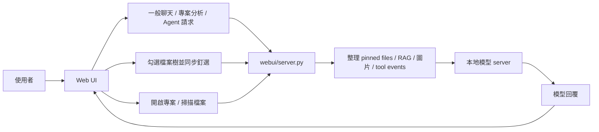

# CodeWorker V1.00.000

> 離線、可攜、以隱私與資安為優先的 Windows 本地 LLM 程式碼助理。

[繁體中文完整說明](README.zh-TW.md) | [English documentation](README.en.md)

---

## 1. 功能說明

`CodeWorker` 將 `llama.cpp`、`WinPython`、`PortableGit`、GGUF 模型與本地 Web UI 整合成可攜式工作目錄，適合以下情境：

- 原始碼不能上傳到雲端
- 客戶端或內網環境無法連外
- 需要在 Windows 本機做 `offline AI` / `local LLM` 專案分析
- 需要帶著整套工具在 USB 隨身碟或外接碟上移動使用

目前產品定位：

- `Gemma 4 26B`
  - 預設主力模型
  - 由 CodeWorker 內建 `llama.cpp` service 啟動，不依賴 Ollama
  - 預設使用 Unsloth `UD-Q4_K_M` GGUF；若 `mmproj` 可用，圖片會直接走 native vision，否則降級為文字附件狀態並交由模型回覆限制
- `Qwen 3.5 9B Vision`
  - 可選備用模型
  - 支援文字與圖片輸入
  - 可用於專案分析、程式碼解釋與圖文問答

---

## 2. 重點注意事項

- 建議以 `32GB RAM` 作為較穩妥的使用目標，但**不是硬性門檻**
- 若使用內顯，共用記憶體會影響模型實際可用 RAM，是否足夠仍需依本機配置自行判斷
- 第一次下載 runtime 與模型時需要網路；`Gemma 4 26B UD-Q4_K_M` 約為 `17GB` 等級，實際大小依 Hugging Face GGUF 檔案而定
- 新版預設兩模型組合會明顯大於舊版 **11.6 GB**，請預留足夠磁碟空間
- 若舊環境仍保留已移除的 `qwen25` 模型檔，整體工作區仍可能接近 **16.6 GB**
- 一般聊天不需要先開啟專案，也不需要釘選檔案；沒有專案上下文時會作為一般問答處理
- 專案分析、修改建議、RAG 與 Agent 動作仍會使用已開啟專案與索引內容
- `檔案樹` 可用來手動釘選精準上下文；未釘選時，只要已開啟專案，一般聊天會走全專案搜尋快取與 RAG
- RAG 會優先回傳實際 source code chunk、檔案路徑與行號；對「哪個檔案」、「哪一段」、「怎麼修改」類問題會降低 README / summary 的優先權
- 小到中型 pinned code 組合會優先送完整檔案；若超出預算改用節錄模式，UI 會顯示 `context coverage`
- 圖片與其他附件會先嘗試交給目前模型；若目前模型或 `llama.cpp` 設定無法處理，CodeWorker 會降級為文字說明，讓模型明確回覆限制
- 對話改用 streaming 顯示；`reasoning_content` 或 `<think>` 內容會保留在可展開的思考區，展開時會自動跟隨最新輸出
- 一般聊天會帶入最近多輪對話作為短期記憶，讓「上一題」、「剛剛那個檔案」這類追問可以連貫

GitHub About 建議文案：

- Description：`離線 Windows 本地 LLM 程式碼助理，支援 Gemma 4 26B、全專案 RAG、附件分析與隱私優先的本機專案理解。`
- Topics：`offline-ai`, `local-llm`, `windows`, `code-assistant`, `privacy-first`, `llama-cpp`

---

## 3. 安裝方式

### 方式 A：第一次完整準備

```cmd
scripts\bootstrap.cmd
```

這會自動處理：

- 下載 `llama.cpp`
- 下載 `PortableGit`
- 下載 `WinPython`
- 下載預設模型

### 方式 B：如果你要用 CLI agent

```cmd
scripts\install-aider.cmd
```

---

## 4. 使用方式與教學

### 啟動 Web UI

```cmd
scripts\launch-webui.cmd
```

開啟：

```text
http://127.0.0.1:8764
```

### 畫面範例


### 基本操作流程

1. 在 `專案路徑` 選擇你的專案根目錄
2. 在 `模型` 使用預設的 `Gemma 4 26B`，或切換成 `Qwen 3.5 9B Vision`
3. 點 `開啟專案`
4. 在 `檔案樹` 直接勾選要加入上下文的檔案
5. 勾選或取消勾選後，釘選狀態會立即同步
6. 在主對話框輸入問題、需求或修改方向；若尚未開啟專案，也可以直接作一般問答

### 圖片問答

1. 點 `上傳檔案`，或直接把截圖貼到聊天輸入區
2. 若目前所選模型支援圖片，請求會直接使用目前模型
3. 若目前所選模型不支援圖片，CodeWorker 會把附件狀態轉成文字提示，讓模型自行回覆限制
4. 大型截圖會先自動縮圖；支援 vision projection 的模型可直接接收圖片

### 建議教學題目

- 「請說明這個專案的入口流程」
- 「請比較 `Form1.cs` 與 `AudioManager.cs` 的職責」
- 「想更新遊戲速度要怎麼修改？請列出檔案路徑、行號與原因」
- 「請依照已釘選檔案，說明這段 API 的功能」
- 「請閱讀這張截圖並翻譯成繁體中文」

---

## 5. 檔案結構說明

主要目錄如下：

```text
CodeWorker/
├─ config/        # bootstrap、模型與 aider 設定
├─ docs/          # 截圖與內部文件
├─ downloads/     # 初次下載暫存
├─ logs/          # 啟動與執行記錄
├─ models/        # GGUF 模型與 mmproj
├─ runtime/       # WinPython、PortableGit、llama.cpp
├─ scripts/       # bootstrap、啟動 server、啟動 Web UI、CLI 入口
├─ webui/         # 後端 server.py、RAG/Agent 模組與前端 static 資源
├─ README.md
├─ README.zh-TW.md
└─ README.en.md
```

關鍵檔案：

- `webui/server.py`：Web UI API、模型請求、streaming chat、上下文組裝、圖片預處理
- `webui/core/models.py`：模型 registry、manifest 解析、模型能力與狀態資訊
- `webui/rag/index.py`：本機 hierarchical RAG index、SQLite FTS5 fallback、impact analysis
- `webui/agent/runtime.py`：ReAct-style Agent v1、受控工具呼叫、pending action 與 audit log
- `webui/static/app.js`：前端互動、釘選同步、聊天與檔案附件流程
- `scripts\start-server.cmd`：本地模型啟動入口
- `scripts\code-chat.cmd`：專案級 CLI 對話入口
- `config\bootstrap.manifest.json`：bootstrap 下載與預設模型配置

---

## 6. 流程架構說明



實際行為重點：

- `開啟專案` 會掃描檔案、入口點與測試位置
- `檔案樹` 是手動上下文選擇入口；未釘選時，RAG index 會自動提供檢索式上下文
- 圖片會與文字請求一起送入後端，再依模型能力直接處理或降級為文字附件狀態
- 若上下文不足以送完整檔案，後端會改為節錄模式，前端顯示 `context coverage`
- 最近多輪對話會作為短期記憶放入 chat request；若本輪 RAG / pinned context 與歷史衝突，以本輪專案內容為準
- Agent 的 write、patch、delete、command 類動作必須先產生 pending action，使用者確認後才會執行；audit log 存在 `data/agent-actions.jsonl`

---

## 7. 版本歷程

### V1.00.000

- 預設模型改為 `Gemma 4 26B`，`Qwen 3.5 9B Vision` 保留為可選備用模型
- 新增 bundled FFmpeg runtime，用於影片上傳後依本機硬體評估抽取 keyframes，再交給支援圖片的模型分析
- 新增 bundled `whisper.cpp` speech-to-text pipeline，音訊與影片音軌會先嘗試產生 transcript；若本機沒有 STT backend，UI 與 prompt 會顯示明確狀態
- 移除右側檔案預覽面板，對話區改為單欄寬版；檔案樹點檔名會切換釘選上下文
- 修正長回覆續寫流程：模型只輸出 thinking/reasoning 時會自動要求 final answer，使用者要求「繼續」時會沿用最近對話歷史而不是重新塞入全專案 RAG
- 新增一般聊天短期記憶：所有模型都會收到最近多輪對話，改善追問與上下文連貫
- 強化 RAG 程式碼定位：中文查詢會展開常見程式命名，例如「遊戲速度」會搜尋 `speed`、`Timer`、`Interval`、`Tick`、`gameSpeed`
- 思考區展開時會自動捲到最新輸出，避免本地模型長時間輸出時畫面停在舊內容
- 影片 metadata-only fallback 會明確禁止模型根據檔名、網址或 metadata 猜測內容
- Gemma4 啟動檢查會確認實際 `model_path` 與 vision `mmproj` 狀態，避免誤用舊模型服務
- 清理舊 Gemma4 模型目錄，保留目前有效的 Unsloth `UD-Q4_K_M` 與 Qwen 備用模型

### V0.98b

- `Gemma 4` 從 E4B 更新為 26B GGUF，改由 CodeWorker 內建 `llama.cpp` service 服務，不依賴 Ollama
- 一般聊天解除「必須開啟專案 / 必須釘選檔案」限制
- 新增 `/api/chat/stream`，完整顯示模型 streaming content 與 reasoning/thinking 輸出
- 新增本機 RAG index、Agent v1 API、pending action 確認與 audit log
- `Qwen 3.5` 在當時取代 `Qwen 2.5` 成為預設模型；`V1.00.000` 起預設模型已改為 `Gemma 4 26B`
- Web UI 的檔案附件提示與按鈕整併到同一列，減少版面高度
- pinned file context 預算上調，小型 C# 專案更容易送完整檔案
- 新增 `context coverage` 顯示，避免使用者誤以為模型看過完整原始碼
- README 與產品定位更新為兩模型組合與新版容量說明

### V0.97b

- 回應流程收斂為較接近模型原始輸出的 `raw-first` 路線
- 改善大型 pinned file 只剩檔名、缺少內容的問題
- 更新中英文 Web UI 截圖與雙語 README

### V0.96b

- README 首頁、繁中、英文文件同步更新
- Web UI 與說明文件對齊當時的雙模型定位

### V0.95b

- 新增 README landing page
- 新增繁中 / EN Web UI 語言切換

### V0.94b

- 移除舊的修改建議 modal
- 所有分析與迭代回到主對話框

---

## 8. 版權宣告

本專案採用 [MIT](LICENSE) 授權。

若你在客戶端、內網或 air-gapped environment 使用本工具，仍需自行確認：

- 本地模型與第三方 runtime 的授權條件
- 客戶環境對可攜式工具、USB 與離線 AI 的使用規範
- 你的專案與資料是否允許被本機模型讀取
