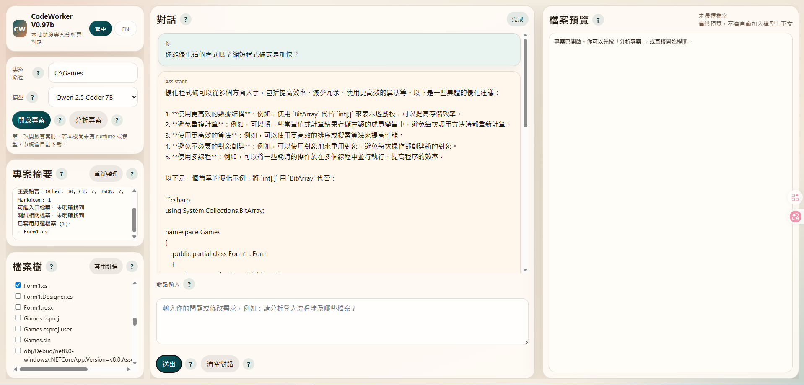
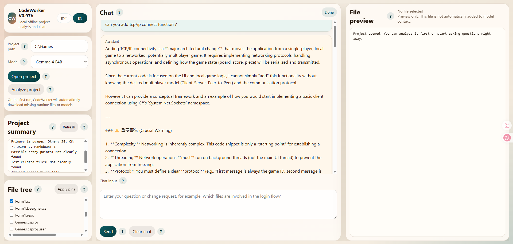

# CodeWorker V0.98b

Offline AI code assistant for **Windows local LLM**, **USB portable** deployment, and **privacy-first secure code analysis**.

[English](README.en.md) | [繁體中文](README.zh-TW.md)

`CodeWorker` is built for environments where source code cannot leave the machine:

- **offline AI**
- **local LLM**
- **USB portable**
- **secure code analysis**
- **offline coding assistant**
- **on-premise**
- **air-gapped environment**
- **Windows local AI**

It packages `llama.cpp`, `WinPython`, `PortableGit`, GGUF models, and a local Web UI into one portable workspace that can be carried on a USB drive and used on different Windows machines.

---

## Why CodeWorker

Many real projects cannot use cloud AI tools:

- customer environments with no internet access
- air-gapped or internal-only networks
- source code that cannot be uploaded
- privacy-first or compliance-heavy development
- on-site maintenance where you need a local AI code assistant immediately

CodeWorker is designed for exactly those cases.

---

## Highlights

- Analyze a **whole project folder**, not just a single file
- Chat in **Traditional Chinese**
- Use pinned files as the only trusted model context
- Run as a **local LLM** on Windows without sending code to cloud services
- Carry the whole tool as a **USB portable** workspace
- Support offline project analysis, code explanation, and change suggestions

Current model positioning:

- `Qwen 3.5 9B Vision`: default and recommended, supports both text and image input
- `Gemma 4 E4B`: secondary optional model for text analysis in the current `llama.cpp + GGUF` route

---

## Web UI Screenshots

Traditional Chinese UI with `Qwen 3.5 9B Vision`:



English UI with `Gemma 4 E4B`:



---

## Quick Start

### 1. Clone or copy the project

Put the entire `CodeWorker` folder on your local disk or USB drive.

### 2. Bootstrap runtime and models

```cmd
scripts\bootstrap.cmd
```

### 3. Launch the Web UI

```cmd
scripts\launch-webui.cmd
```

Open:

```text
http://127.0.0.1:8764
```

### 4. Use the workspace

1. Click the project path field and choose a project folder
2. Open the project
3. Check files in the file tree
4. The pin state syncs immediately when you check or uncheck files
5. Ask questions in the main chat

### Response behavior

- General chat and `Analyze project` use a raw-first prompt flow
- CodeWorker keeps the pinned-file content delimiters, but does not auto-route feature requests into edit plans
- The synced pinned files are still the only trusted context source
- Small to medium pinned code sets are sent to `Qwen 3.5` as full files whenever the local context budget allows it
- If the request falls back to excerpt mode, the Web UI now shows that the model only received excerpts instead of full files

---

## Typical Use Cases

- Understand an unfamiliar codebase in an offline or air-gapped environment
- Investigate a customer project that cannot be uploaded to cloud AI tools
- Use a **local LLM** for secure code analysis on a Windows machine
- Carry a **USB portable** AI assistant for on-site support, maintenance, and debugging
- Compare `Qwen 3.5` and `Gemma 4 E4B` behavior on the same pinned files

---

## Documentation

- [繁體中文完整說明](README.zh-TW.md)
- [English documentation](README.en.md)

The full docs include:

- installation guide
- system requirements
- Web UI walkthrough
- CLI usage
- feature explanation
- version history
- important notes
- known limitations

---

## Important Notes

- First-time download size is **over 5GB** and may take time depending on network speed and USB / disk write speed.
- The new default two-model layout is roughly **11.6 GB** after removing `Qwen 2.5` from the packaged route.
- Older machines that still keep the removed `qwen25` files can remain near the previous **16.6 GB** footprint until those old model files are actually deleted.
- The current default product direction is `Qwen 3.5` first, `Gemma 4 E4B` second.
- `Gemma 4 E4B` in this project should still be treated as a text model unless the local `llama.cpp` GGUF route is explicitly verified for image input; a successful Ollama Desktop screenshot does not automatically prove parity here.
- The request flow now aligns more closely with Ollama-style concepts such as image-capable models, answer-only output, and explicit completion-state handling, while still staying on the existing `llama.cpp` backend.
- Larger screenshots are automatically downscaled before they are sent to `Qwen 3.5`, reducing the chance of `failed to process image` errors on high-resolution inputs.
- This project focuses on **offline AI**, **local LLM**, and **privacy-first** project understanding.

---

## License

[MIT](LICENSE)
