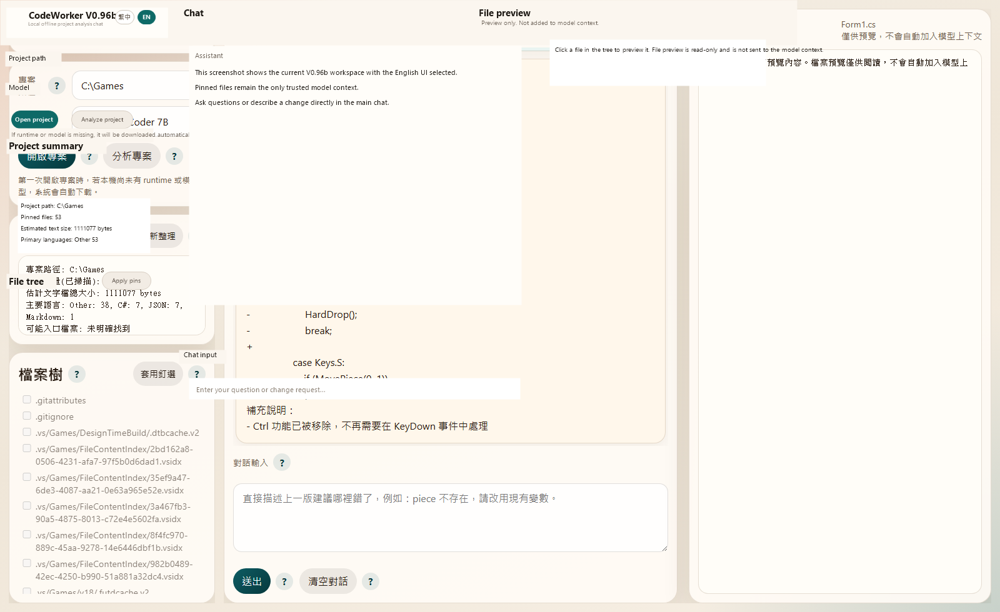
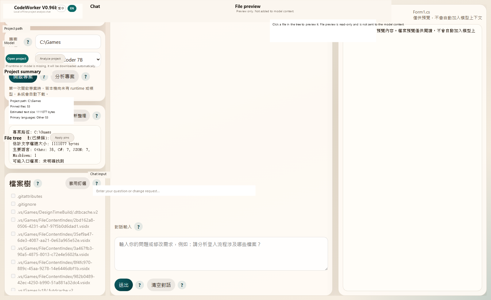

# CodeWorker V0.96b

Offline AI code assistant for **Windows local LLM**, **USB portable** deployment, and **privacy-first secure code analysis**.

[English](README.en.md) | [繁體中文](README.zh-TW.md)

`CodeWorker` is built for environments where source code cannot leave the machine:

- **offline AI**
- **local LLM**
- **USB portable**
- **secure code analysis**
- **offline coding assistant**
- **on-premise**
- **air-gapped environment**
- **Windows local AI**

It packages `llama.cpp`, `WinPython`, `PortableGit`, GGUF models, and a local Web UI into one portable workspace that can be carried on a USB drive and used on different Windows machines.

---

## Why CodeWorker

Many real projects cannot use cloud AI tools:

- customer environments with no internet access
- air-gapped or internal-only networks
- source code that cannot be uploaded
- privacy-first or compliance-heavy development
- on-site maintenance where you need a local AI code assistant immediately

CodeWorker is designed for exactly those cases.

---

## Highlights

- Analyze a **whole project folder**, not just a single file
- Chat in **Traditional Chinese**
- Use pinned files as the only trusted model context
- Run as a **local LLM** on Windows without sending code to cloud services
- Carry the whole tool as a **USB portable** workspace
- Support offline project analysis, code explanation, and change suggestions

Current model positioning:

- `Qwen 2.5 Coder 7B`: default and recommended
- `Gemma 4 E4B`: optional evaluation model, not the default

---

## Web UI Screenshots

### Overview



### Pinned Workspace Example



---

## Quick Start

### 1. Clone or copy the project

Put the entire `CodeWorker` folder on your local disk or USB drive.

### 2. Bootstrap runtime and models

```cmd
scripts\bootstrap.cmd
```

### 3. Launch the Web UI

```cmd
scripts\launch-webui.cmd
```

Open:

```text
http://127.0.0.1:8764
```

### 4. Use the workspace

1. Click the project path field and choose a project folder
2. Open the project
3. Check files in the file tree
4. Click `Apply pins`
5. Ask questions in the main chat

### Response behavior

- General chat and `Analyze project` now stay closer to each model's original output
- CodeWorker no longer adds heavy reply cleanup or style compression in these two flows
- The applied pinned files are still the only trusted context source

---

## Typical Use Cases

- Understand an unfamiliar codebase in an offline or air-gapped environment
- Investigate a customer project that cannot be uploaded to cloud AI tools
- Use a **local LLM** for secure code analysis on a Windows machine
- Carry a **USB portable** AI assistant for on-site support, maintenance, and debugging
- Compare `Qwen` and `Gemma 4 E4B` behavior on the same pinned files

---

## Documentation

- [繁體中文完整說明](README.zh-TW.md)
- [English documentation](README.en.md)

The full docs include:

- installation guide
- system requirements
- Web UI walkthrough
- CLI usage
- feature explanation
- version history
- important notes
- known limitations

---

## Important Notes

- First-time download size is **over 5GB** and may take time depending on network speed and USB / disk write speed.
- `Qwen 2.5 Coder 7B` remains the default model.
- `Gemma 4 E4B` is integrated as an **evaluation model**, not the recommended default.
- This project focuses on **offline AI**, **local LLM**, and **privacy-first** project understanding.

---

## License

[MIT](LICENSE)
