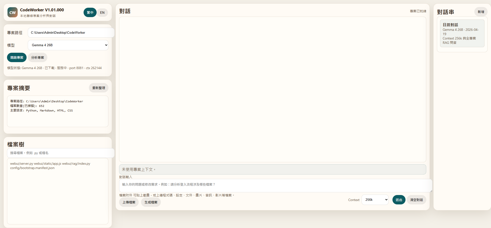
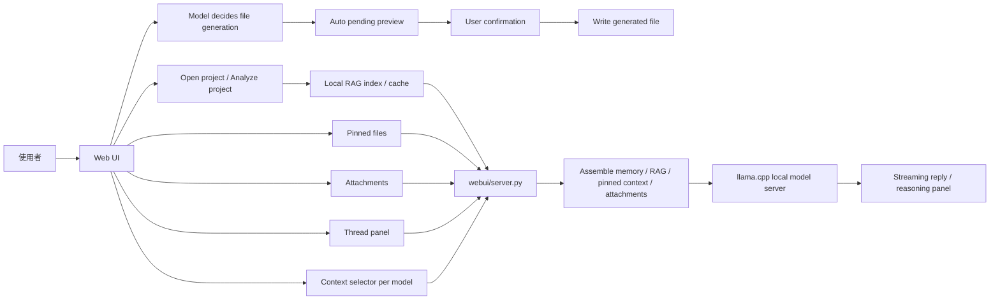

# CodeWorker V1.01.000

> 離線、可攜、以隱私與資安為優先的 Windows 本地 LLM 程式碼助理。

[繁體中文完整說明](README.zh-TW.md) | [English](README.en.md)

---

## 1. 功能說明

`CodeWorker` 將 `llama.cpp`、`WinPython`、`PortableGit`、GGUF 模型與 Web UI 整合在同一個 Windows 工作目錄。它適合不能上傳原始碼、不能使用雲端模型，或需要帶到客戶端、內網、air-gapped environment 的開發情境。

主要能力：

- 本機模型服務：預設使用 `Gemma 4 26B`，由 bundled `llama.cpp` service 啟動，不需要 Ollama。
- 可選模型：保留 `Qwen 3.5 9B Vision`，兩個模型都走同一套 chat、RAG、附件與安全流程。
- Context 下拉選單：每個模型可獨立選擇 `4k / 8k / 16k / 32k / 64k / 128k / 256k`，預設 `256k`。
- 全專案檢索：開啟專案後，即使沒有 pinned files，也會使用本機 RAG index 搜尋相關檔案、symbols、summary 與 chunks。
- 聚焦上下文：在 `檔案樹` 勾選檔案時，pinned files 會優先於全專案 RAG。
- 附件分析：支援程式碼、設定、文件、圖片、音訊與影片；可抽文字、keyframes 或 transcript 時會送入模型，否則送 metadata fallback。
- 多對話串：右側 `240px` thread panel 可新增、切換、重新命名、刪除對話串，每個 thread 保留自己的 history 與 memory。
- 模型主導檔案生成：在一般對話中要求產生文件即可，模型會先產生內容與標題，CodeWorker 依模型標題自動命名並建立 pending preview；確認後才寫入 `.txt/.md/.py/.js/.ts/.json/.html/.css/.yaml/.sql/.cs/.docx/.pdf/.pptx/.xlsx`。
- Agent 安全機制：寫檔、patch、刪檔與執行 command 前都會建立 pending action，使用者確認後才執行。

---

## 2. 重點注意事項

- 第一次執行需要網路下載 runtime 與模型；完成後可離線使用。
- `256k` context 是可選上限，不代表每台機器都能穩定跑滿；若模型啟動失敗，UI 會顯示錯誤與 log path，不會自動降級。
- 建議至少 `32GB RAM` 等級；大型 context、圖片、影片 keyframes 與長回答都會增加記憶體壓力。
- 未開啟專案時只做一般問答；已開啟專案且未釘選檔案時使用全專案 RAG；有 pinned files 時優先使用 pinned context。
- 影片不是直接把 MP4 binary 丟給模型，而是先用 `FFmpeg` 抽 keyframes；音訊與影片音軌會嘗試 `whisper.cpp` speech-to-text。
- 檔案生成與 Agent 寫入都必須確認後才會落到 project root；生成完成後 UI 會顯示實際檔案路徑與檔名。

---

## 3. 安裝方式

### 第一次完整準備

```cmd
scripts\bootstrap.cmd
```

這會依 `config\bootstrap.manifest.json` 準備：

- `llama.cpp`
- `WinPython`
- `PortableGit`
- `FFmpeg`
- `whisper.cpp` 與 speech-to-text model
- `Gemma 4 26B` / `Qwen 3.5 9B Vision` GGUF 與 `mmproj`
- Python 文件套件：`pypdf`、`pdfplumber`、`python-docx`、`reportlab`、`python-pptx`、`openpyxl`

### 啟動 Web UI

```cmd
scripts\launch-webui.cmd
```

開啟：

```text
http://127.0.0.1:8764
```

### 選用 CLI agent

```cmd
scripts\install-aider.cmd
```

---

## 4. 使用方式與教學

### 畫面範例



### 一般問答

1. 啟動 Web UI。
2. 不必開啟專案，直接在主對話框提問。
3. 此模式不會加入 `PROJECT RAG CONTEXT`、pinned files 或 file tree。

### 專案搜尋與問答

1. 在 `專案路徑` 選擇專案根目錄。
2. 點 `開啟專案`。
3. 需要更新快取時點 `分析專案`。
4. 直接詢問「在哪個檔案」、「哪段 code」、「要怎麼修改」；沒有 pinned files 時會自動用 RAG 搜尋全專案。
5. 若要聚焦少數檔案，在 `檔案樹` 勾選檔名。

推薦問題：

- 「請問加載 model 的 code 在哪個檔案的哪一段？」
- 「想更新遊戲速度要怎麼修改？請列出檔案路徑與原因。」
- 「我加入網路連線對戰，第一步要改哪些檔案？」

### Context 設定

1. 在聊天輸入區底部的 `Context` 下拉選單選擇 `4k` 到 `256k`。
2. 每個模型會記住自己的選擇。
3. 如果現有 `llama-server` context 低於目前選擇，下一次啟動模型時會用新 context 重啟。
4. 若 `256k` 在本機失敗，請看左側錯誤區與 `logs/llama-server-*.err.log`。

### 對話串

- 右側 `對話串` 可新增、切換、重新命名與刪除 thread。
- 每個 thread 保存自己的 `history`、`memory_summary`、`modelKey` 與 `projectPath`。
- `清空對話` 只清目前 thread，不會清掉其他 thread。

### 附件分析

1. 點 `上傳檔案`，或把截圖貼到聊天輸入區。
2. 可上傳程式碼、設定檔、PDF、DOCX、圖片、音訊與影片。
3. 圖片會先嘗試 native vision；影片會先抽 keyframes；音訊會嘗試 speech-to-text。
4. 若 extractor 或 native payload 不可用，CodeWorker 會送 metadata 與限制說明，不會假裝已看見內容。

### 檔案生成

1. 開啟專案。
2. 直接用一般聊天要求模型生成檔案，例如：「我要生成一個專案功能介紹的 PPT 文件」。
3. 模型會先產生文件內容，第一行標題會作為自動命名依據；CodeWorker 會用這份回覆建立 pending preview。
4. 若要把上一則回答輸出成文件，可以直接寫：「把剛剛的說明與使用場景做成一個 PPTX 跟 PDF 檔」或「幫我把說明生成 Word 檔」。
5. 若同一句話提到多個格式，CodeWorker 會建立多個 pending preview，例如 `.pptx` 與 `.pdf` 各一個。
6. Excel 請寫明 `Excel`、`xlsx`、`試算表` 或目標副檔名，例如：「把測試清單做成 Excel 試算表」。
7. 檢查 pending preview 後按「確認寫入」；寫入完成後，對話中會顯示實際路徑與檔名。

---

## 5. 檔案結構說明

```text
CodeWorker/
├─ config/        # bootstrap、模型 registry 與 aider 設定
├─ data/          # RAG indexes、chat threads、本機 context 選擇與 audit log
├─ docs/          # 截圖、內部文件與測試筆記
├─ downloads/     # bootstrap 下載暫存
├─ logs/          # Web UI、model server 與 context bench log
├─ models/        # GGUF 模型與 mmproj
├─ runtime/       # WinPython、PortableGit、llama.cpp、FFmpeg、whisper.cpp
├─ scripts/       # bootstrap、模型解析、server 啟動與回歸測試
├─ webui/         # Python 後端、RAG/Agent 模組與前端資源
├─ README.md
├─ README.zh-TW.md
└─ README.en.md
```

重要檔案：

- `config\bootstrap.manifest.json`：runtime、模型來源、`contextWindow`、KV cache type、`mmproj` 與預設設定。
- `scripts\resolve_model_env.py`：依 manifest 解析模型檔、port、context、KV cache type 與 `mmproj`。
- `scripts\launch_llama_server.py`：啟動 bundled `llama.cpp` model server。
- `scripts\run_webui_regression.py`：Web UI、附件、RAG 與 streaming 回歸測試。
- `webui\server.py`：API routes、streaming chat、context assembly、threads、file generation、attachment handling、memory 與 model call。
- `webui\core\models.py`：模型 registry、狀態與 OpenAI-compatible endpoint 資訊。
- `webui\rag\index.py`：hierarchical project index、SQLite FTS5 fallback、chunk search 與 impact hints。
- `webui\agent\runtime.py`：ReAct-style Agent、tool calls、pending actions 與 audit log。
- `webui\static\app.js`：前端聊天、context 下拉、threads、附件、檔案樹與 streaming。
- `webui\static\styles.css`：450px sidebar、主 chat 與 240px thread panel。

---

## 6. 流程架構說明



流程重點：

- 沒有開啟專案時，chat payload 只包含使用者問題、附件與對話記憶。
- 開啟專案但沒有 pinned files 時，RAG index 會依問題搜尋相關檔案、symbols、summary 與 chunks。
- 有 pinned files 時，會優先使用 pinned context。
- 長回答續寫使用上一段回答 tail，不再重送大型 `PROJECT RAG CONTEXT`。
- 檔案生成由一般聊天觸發；模型先產生內容與標題，CodeWorker 再建立 pending preview。同一句多格式需求會建立多個 preview，文件輸出會清理 Markdown 標記並使用可顯示中文的 PDF 字型。

---

## 7. 版本歷程

### V1.01.000

- 新增每模型獨立 `Context` 下拉選單，固定支援 `4k / 8k / 16k / 32k / 64k / 128k / 256k`。
- `Gemma 4 26B` 與 `Qwen 3.5 9B Vision` 預設 context 改為 `256k`，啟動時傳入 `llama-server -c 262144`。
- 新增 KV cache type 設定，預設 `cacheTypeK=q4_0`、`cacheTypeV=q4_0`。
- 新增右側 `240px` 對話串面板，支援新增、切換、重新命名與刪除 thread。
- 新增 file generation pending workflow，支援 text/code、`.docx`、`.pdf`、`.pptx`、`.xlsx`。
- 移除前端 `生成檔案` 按鈕，檔案生成改由模型在一般聊天中判斷並發起。
- 檔名改由模型回覆的第一個 Markdown H1 標題自動命名，寫入完成後顯示實際檔案路徑。
- 檔案生成可解析「PPTX 跟 PDF」等多格式需求，並在提到「剛剛 / 上一則」時使用上一則 assistant 可見回答當內容來源。
- 修正 PDF 中文亂碼、PPTX / DOCX 暴露 Markdown 標記，以及「把說明生成 Word 檔」未使用上一則回答的問題。
- `scripts\bootstrap.ps1` 新增 `pdfplumber`、`reportlab`、`python-pptx` 與 `openpyxl`。
- README、流程圖、檔案結構與使用教學更新到 V1.01.000。

### V1.00.000

- 預設模型改為 `Gemma 4 26B`，`Qwen 3.5 9B Vision` 保留為可選備用模型。
- Gemma4 改用 Unsloth GGUF 與 bundled `llama.cpp`，並檢查實際 `model_path` 與 vision `mmproj` 狀態。
- 新增全專案 RAG 搜尋，未釘選檔案也能找相關檔案、片段與行號。
- 新增通用附件流程：文件抽文字、圖片 native vision、影片 keyframes、音訊 / 影片音軌 speech-to-text，失敗時提供 metadata fallback。
- 新增壓縮式對話記憶與最近多輪原文，改善追問連貫並降低 token 使用量。
- 修正長回答截斷與「請繼續」問題。
- 思考過程改為預設摺疊，展開時自動捲到最新輸出。
- 移除右側檔案預覽面板，改為 450px sidebar 與單欄寬版 chat。

### V0.98b

- `Gemma 4` 從 E4B 更新為 26B GGUF，改由 CodeWorker 內建 `llama.cpp` service 服務，不依賴 Ollama。
- 一般聊天解除「必須開啟專案 / 必須釘選檔案」限制。
- 新增 `/api/chat/stream`，顯示 streaming content 與 reasoning/thinking 輸出。
- 新增本機 RAG index、Agent v1 API、pending action 確認與 audit log。

### V0.97b

- 主對話框與 `分析專案` 收斂為較接近模型原始輸出的 `raw-first` 路線。
- 修正大型 pinned file 僅剩檔名、內容不足的問題。

### V0.96b

- README landing page、中英文文件與 UI 對齊。

### V0.95b

- 建立 README landing page 與雙語文件分流。
- Web UI 新增 `繁中 / EN` 語言切換。

### V0.94b

- 移除舊的修改建議 modal。
- 所有分析與修正迭代回到主對話框。

---

## 8. 版權宣告

本專案採用 [MIT](LICENSE) 授權。

在客戶端、內網或 air-gapped environment 使用本工具時，仍需自行確認：

- 本地模型與第三方 runtime 的授權條件。
- 客戶環境對 USB、可攜式工具與 offline AI 的使用規範。
- 目標專案與資料是否允許被本機模型讀取。
