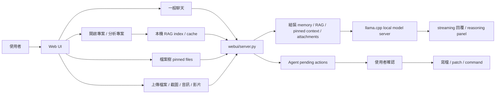

# CodeWorker V1.00.000

> 離線、可攜、以隱私與資安為優先的 Windows 本地 LLM 程式碼助理。

[繁體中文完整說明](README.zh-TW.md) | [English](README.en.md)

---

## 1. 功能說明

`CodeWorker` 將 `llama.cpp`、`WinPython`、`PortableGit`、GGUF 模型與 Web UI 整合在同一個 Windows 工作目錄。它適合在不能上傳原始碼、不能使用雲端模型，或需要 USB / 外接碟攜帶到客戶端的環境中使用。

主要能力：

- 本機模型服務：預設使用 `Gemma 4 26B`，由 CodeWorker 內建 `llama.cpp` service 啟動，不需要 Ollama。
- 備用模型：保留 `Qwen 3.5 9B Vision` 作為可選模型。
- 一般聊天：未開啟專案時可直接問答，不會送出專案資訊。
- 全專案檢索：開啟專案後，未釘選檔案也會使用本機 RAG index 搜尋相關檔案與片段。
- 精準上下文：在 `檔案樹` 勾選檔案時，會優先使用 pinned files 作為聚焦上下文。
- 附件分析：支援上傳程式碼、設定、文件、圖片、音訊與影片；可抽文字、keyframes 或 transcript 時會送入模型，否則提供 metadata fallback。
- 長回答與記憶：streaming 回答支援自動續寫、部分輸出保存、壓縮式對話記憶與最近多輪原文追問。
- Agent 安全機制：寫檔、patch、刪檔與執行 command 前都會建立 pending action，使用者確認後才執行。

目前模型定位：

- `Gemma 4 26B`
  - 預設主力模型
  - 使用 Unsloth GGUF 與 bundled `llama.cpp`
  - 若 `mmproj` 可用，圖片與影片 keyframes 會走 native vision；若不可用，會改用文字、transcript 或 metadata fallback
- `Qwen 3.5 9B Vision`
  - 可選備用模型
  - 可用於文字、圖片、專案問答與截圖理解

---

## 2. 重點注意事項

- 第一次執行需要網路下載 runtime 與模型；之後可離線使用。
- 建議至少預留足夠磁碟空間與 `32GB RAM` 等級的記憶體；實際可用效能會受 GPU、內顯共用記憶體與量化檔影響。
- CodeWorker 不依賴 Ollama；模型由 bundled `llama.cpp` service 啟動。
- 未開啟專案時只做一般問答；已開啟專案且未釘選檔案時，會使用全專案 RAG 搜尋；釘選檔案時會優先使用 pinned context。
- 附件採 best-effort：先嘗試 native model payload，再使用文字抽取、影片 keyframes、語音 transcript 或 metadata fallback。
- Agent 的寫入、patch、刪除與 command 都必須先經使用者確認，並寫入 audit log。

---

## 3. 安裝方式

### 第一次完整準備

```cmd
scripts\bootstrap.cmd
```

這會依 `config\bootstrap.manifest.json` 準備：

- `llama.cpp`
- `WinPython`
- `PortableGit`
- `FFmpeg`
- `whisper.cpp` runtime（若 manifest 啟用）
- 預設模型與 `mmproj`

### 啟動 Web UI

```cmd
scripts\launch-webui.cmd
```

開啟：

```text
http://127.0.0.1:8764
```

### 選用 CLI agent

```cmd
scripts\install-aider.cmd
```

---

## 4. 使用方式與教學

### 畫面範例


### 一般問答

1. 啟動 Web UI。
2. 不必開啟專案，直接在主對話框提問。
3. 此模式不會加入 `PROJECT RAG CONTEXT`、pinned files 或 file tree。

### 專案搜尋與問答

1. 在 `專案路徑` 選擇專案根目錄。
2. 點 `開啟專案`。
3. 若要讓 CodeWorker 建立或更新索引，點 `分析專案`。
4. 直接詢問檔案位置、流程、修改方式或錯誤原因；未釘選檔案時會使用全專案 RAG 搜尋。
5. 若要聚焦少數檔案，在 `檔案樹` 勾選檔名；勾選狀態會立即同步為 pinned context。

推薦問題：

- 「請問加載 model 的 code 在哪個檔案的哪一段？」
- 「想更新遊戲速度要怎麼修改？請列出檔案路徑、行號與原因。」
- 「這個錯誤可能跟哪些檔案有關？」
- 「請根據目前專案說明登入流程。」

### 附件分析

1. 點 `上傳檔案`，或把截圖貼到聊天輸入區。
2. 可上傳程式碼、設定檔、文件、圖片、音訊與影片。
3. 文字與程式碼會盡量抽文字；PDF / DOCX 會在本機 extractor 可用時抽文字。
4. 圖片會先嘗試 native vision；影片會先嘗試用 `FFmpeg` 抽 keyframes；音訊與影片音軌會先嘗試 speech-to-text。
5. 若本機缺少可用 extractor 或模型無法接收該模態，CodeWorker 會把 metadata 與限制說明送入模型，不會假裝已看見內容。

### 長回答與追問

- 思考過程預設摺疊，可展開完整查看；展開時會自動捲到最新輸出。
- 如果模型因 `finish_reason=length` 停住，CodeWorker 會用上一段回答末尾自動續寫，不會重送大型 RAG context。
- 如果 streaming 中途失敗，已產生的內容會保留在 history，下一句「請繼續」可以接續。
- 較舊對話會壓縮成 memory summary，最近幾輪保留原文，以降低 token 使用量並維持追問連貫。

---

## 5. 檔案結構說明

```text
CodeWorker/
├─ config/        # bootstrap、模型 registry 與 aider 設定
├─ data/          # RAG indexes、Agent audit log、本機狀態資料
├─ docs/          # 截圖、內部文件與測試筆記
├─ downloads/     # bootstrap 下載暫存
├─ logs/          # Web UI 與 model server log
├─ models/        # GGUF 模型與 mmproj
├─ runtime/       # WinPython、PortableGit、llama.cpp、FFmpeg、whisper.cpp
├─ scripts/       # bootstrap、模型解析、server 啟動與回歸測試
├─ webui/         # Python 後端、RAG/Agent 模組與前端資源
├─ README.md
├─ README.zh-TW.md
└─ README.en.md
```

重要檔案：

- `config\bootstrap.manifest.json`：runtime、模型來源、模型路徑、`mmproj` 與預設設定。
- `scripts\resolve_model_env.py`：依 manifest 解析模型檔、port、context 與 `mmproj`。
- `scripts\launch_llama_server.py`：啟動 bundled `llama.cpp` model server。
- `scripts\launch-webui.cmd`：啟動 Web UI。
- `scripts\run_webui_regression.py`：Web UI 與附件/RAG 回歸測試。
- `webui\server.py`：API routes、streaming chat、context assembly、attachment handling、memory 與 model call。
- `webui\core\models.py`：模型 registry、狀態、健康檢查與 OpenAI-compatible endpoint 資訊。
- `webui\rag\index.py`：hierarchical project index、SQLite FTS5 fallback、chunk search 與 impact hints。
- `webui\agent\runtime.py`：ReAct-style Agent、tool calls、pending actions 與 audit log。
- `webui\static\app.js`：前端聊天、streaming、附件、檔案樹與模型切換。
- `webui\static\styles.css`：450px sidebar 與單欄 chat layout。

---

## 6. 流程架構說明



流程重點：

- 沒有開啟專案時，chat payload 只包含使用者問題、附件與對話記憶。
- 開啟專案但沒有 pinned files 時，RAG index 會依問題搜尋相關檔案、symbols、summary 與 chunks。
- 有 pinned files 時，會優先使用 pinned context，避免混入不相關專案內容。
- 附件會先走原生多模態 payload；失敗後才使用 extractor 或 metadata fallback。
- 長回答續寫使用上一段回答 tail，不再重複塞入大型 `PROJECT RAG CONTEXT`。
- Agent 只能直接讀取與搜尋；寫入與 command 類動作都需要 pending confirmation。

---

## 7. 版本歷程

### V1.00.000

- 預設模型改為 `Gemma 4 26B`，`Qwen 3.5 9B Vision` 保留為可選備用模型。
- Gemma4 改用 Unsloth GGUF 與 bundled `llama.cpp`，並檢查實際 `model_path` 與 vision `mmproj` 狀態。
- 新增全專案 RAG 搜尋：未釘選檔案也能在已開啟專案中搜尋相關檔案、片段與行號。
- 強化中文查詢展開，改善「遊戲速度」、「加載 model」這類自然語言問題的程式碼定位。
- 新增通用附件流程：文件抽文字、圖片 native vision、影片 keyframes、音訊 / 影片音軌 speech-to-text，失敗時提供 metadata fallback。
- 新增 bundled `FFmpeg` 與 `whisper.cpp` speech-to-text pipeline。
- 新增壓縮式對話記憶與最近多輪原文，改善追問連貫並降低 token 使用量。
- 修正長回答截斷與「請繼續」問題：自動續寫只帶回答 tail，streaming 失敗時保留部分輸出。
- 思考過程改為預設摺疊，展開時自動捲到最新輸出。
- 移除右側檔案預覽面板，改為 450px sidebar 與單欄寬版 chat。
- Agent write、patch、delete、command 動作改為 pending action + confirmation + audit log。
- README、流程圖、檔案結構與使用教學更新到 V1.00.000。

### V0.98b

- `Gemma 4` 從 E4B 更新為 26B GGUF，改由 CodeWorker 內建 `llama.cpp` service 服務，不依賴 Ollama。
- 一般聊天解除「必須開啟專案 / 必須釘選檔案」限制。
- 新增 `/api/chat/stream`，顯示 streaming content 與 reasoning/thinking 輸出。
- 新增本機 RAG index、Agent v1 API、pending action 確認與 audit log。
- `Qwen 3.5` 在當時取代 `Qwen 2.5` 成為預設模型；`V1.00.000` 起預設模型已改為 `Gemma 4 26B`。
- Web UI 整併附件提示與附件控制，並新增 `context coverage`。

### V0.97b

- 主對話框與 `分析專案` 收斂為較接近模型原始輸出的 `raw-first` 路線。
- 修正大型 pinned file 僅剩檔名、內容不足的問題。
- 更新 Web UI 與雙語 README 截圖。

### V0.96b

- README landing page、中英文文件與 UI 對齊。
- 回應方式調整為更接近模型原始輸出。

### V0.95b

- 建立 README landing page 與雙語文件分流。
- Web UI 新增 `繁中 / EN` 語言切換。

### V0.94b

- 移除舊的修改建議 modal。
- 所有分析與修正迭代回到主對話框。

---

## 8. 版權宣告

本專案採用 [MIT](LICENSE) 授權。

在客戶端、內網或 air-gapped environment 使用本工具時，仍需自行確認：

- 本地模型與第三方 runtime 的授權條件。
- 客戶環境對 USB、可攜式工具與 offline AI 的使用規範。
- 目標專案與資料是否允許被本機模型讀取。
