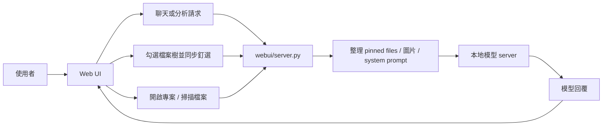

# CodeWorker V0.98b

> 離線、可攜、以隱私與資安為優先的 Windows 本地 LLM 程式碼助理。

[繁體中文完整說明](README.zh-TW.md) | [English documentation](README.en.md)

---

## 1. 功能說明

`CodeWorker` 將 `llama.cpp`、`WinPython`、`PortableGit`、GGUF 模型與本地 Web UI 整合成可攜式工作目錄，適合以下情境：

- 原始碼不能上傳到雲端
- 客戶端或內網環境無法連外
- 需要在 Windows 本機做 `offline AI` / `local LLM` 專案分析
- 需要帶著整套工具在 USB 隨身碟或外接碟上移動使用

目前產品定位：

- `Qwen 3.5 9B Vision`
  - 預設與主力模型
  - 支援文字與圖片輸入
  - 主要用於專案分析、程式碼解釋與圖文問答
- `Gemma 4 E4B`
  - 第二模型
  - 目前在本專案中定位為文字分析模型
  - 尚未列為本專案正式支援的圖片模型

---

## 2. 重點注意事項

- 建議以 `32GB RAM` 作為較穩妥的使用目標，但**不是硬性門檻**
- 若使用內顯，共用記憶體會影響模型實際可用 RAM，是否足夠仍需依本機配置自行判斷
- 第一次下載 runtime 與模型時需要網路，且下載量會超過 `5GB`
- 新版預設兩模型組合約為 **11.6 GB**
- 若舊環境仍保留已移除的 `qwen25` 模型檔，整體工作區仍可能接近 **16.6 GB**
- `檔案預覽` 只是閱讀區，不會自動成為模型上下文
- 模型只會根據**已同步釘選檔案**回答
- 小到中型 pinned code 組合，`Qwen 3.5` 會優先送完整檔案；若超出預算改用節錄模式，UI 會顯示 `context coverage`
- 圖片問答目前正式支援 `Qwen 3.5 9B Vision`；若目前所選模型不支援圖片，Web UI 會明確提示

GitHub About 建議文案：

- Description：`離線 Windows 本地 LLM 程式碼助理，支援 Qwen 3.5 圖文分析、釘選檔案上下文與隱私優先的本機專案理解。`
- Topics：`offline-ai`, `local-llm`, `windows`, `code-assistant`, `privacy-first`, `llama-cpp`

---

## 3. 安裝方式

### 方式 A：第一次完整準備

```cmd
scripts\bootstrap.cmd
```

這會自動處理：

- 下載 `llama.cpp`
- 下載 `PortableGit`
- 下載 `WinPython`
- 下載預設模型

### 方式 B：如果你要用 CLI agent

```cmd
scripts\install-aider.cmd
```

---

## 4. 使用方式與教學

### 啟動 Web UI

```cmd
scripts\launch-webui.cmd
```

開啟：

```text
http://127.0.0.1:8764
```

### 畫面範例


### 基本操作流程

1. 在 `專案路徑` 選擇你的專案根目錄
2. 在 `模型` 保持 `Qwen 3.5 9B Vision`，或切換成 `Gemma 4 E4B`
3. 點 `開啟專案`
4. 在 `檔案樹` 直接勾選要加入上下文的檔案
5. 勾選或取消勾選後，釘選狀態會立即同步
6. 在主對話框輸入問題、需求或修改方向

### 圖片問答

1. 點 `上傳圖片`，或直接把截圖貼到聊天輸入區
2. 若目前所選模型支援圖片，請求會直接使用目前模型
3. 若目前所選模型不支援圖片，Web UI 會顯示明確錯誤，不再默默切換模型
4. 大型截圖會先自動縮圖，再送入 `Qwen 3.5`，降低多模態圖片 token 失敗機率

### 建議教學題目

- 「請說明這個專案的入口流程」
- 「請比較 `Form1.cs` 與 `AudioManager.cs` 的職責」
- 「請依照已釘選檔案，說明這段 API 的功能」
- 「請閱讀這張截圖並翻譯成繁體中文」

---

## 5. 檔案結構說明

主要目錄如下：

```text
CodeWorker/
├─ config/        # bootstrap、模型與 aider 設定
├─ docs/          # 截圖與內部文件
├─ downloads/     # 初次下載暫存
├─ logs/          # 啟動與執行記錄
├─ models/        # GGUF 模型與 mmproj
├─ runtime/       # WinPython、PortableGit、llama.cpp
├─ scripts/       # bootstrap、啟動 server、啟動 Web UI、CLI 入口
├─ webui/         # 後端 server.py 與前端 static 資源
├─ README.md
├─ README.zh-TW.md
└─ README.en.md
```

關鍵檔案：

- `webui/server.py`：Web UI API、模型請求、上下文組裝、圖片預處理
- `webui/static/app.js`：前端互動、釘選同步、聊天與圖片附件流程
- `scripts\start-server.cmd`：本地模型啟動入口
- `scripts\code-chat.cmd`：專案級 CLI 對話入口
- `config\bootstrap.manifest.json`：bootstrap 下載與預設模型配置

---

## 6. 流程架構說明



實際行為重點：

- `開啟專案` 會掃描檔案、入口點與測試位置
- `檔案樹` 是唯一的上下文選擇入口
- `檔案預覽` 只負責閱讀，不會自動加入模型上下文
- 圖片會與文字請求一起送入後端，再依模型能力決定是否可執行
- 若上下文不足以送完整檔案，後端會改為節錄模式，前端顯示 `context coverage`

---

## 7. 版本歷程

### V0.98b

- `Qwen 3.5` 正式取代 `Qwen 2.5` 成為預設模型
- Web UI 的圖片附件提示與按鈕整併到同一列，減少版面高度
- pinned file context 預算上調，小型 C# 專案更容易送完整檔案
- 新增 `context coverage` 顯示，避免使用者誤以為模型看過完整原始碼
- README 與產品定位更新為兩模型組合與新版容量說明

### V0.97b

- 回應流程收斂為較接近模型原始輸出的 `raw-first` 路線
- 改善大型 pinned file 只剩檔名、缺少內容的問題
- 更新中英文 Web UI 截圖與雙語 README

### V0.96b

- README 首頁、繁中、英文文件同步更新
- Web UI 與說明文件對齊當時的雙模型定位

### V0.95b

- 新增 README landing page
- 新增繁中 / EN Web UI 語言切換

### V0.94b

- 移除舊的修改建議 modal
- 所有分析與迭代回到主對話框

---

## 8. 版權宣告

本專案採用 [MIT](LICENSE) 授權。

若你在客戶端、內網或 air-gapped environment 使用本工具，仍需自行確認：

- 本地模型與第三方 runtime 的授權條件
- 客戶環境對可攜式工具、USB 與離線 AI 的使用規範
- 你的專案與資料是否允許被本機模型讀取
