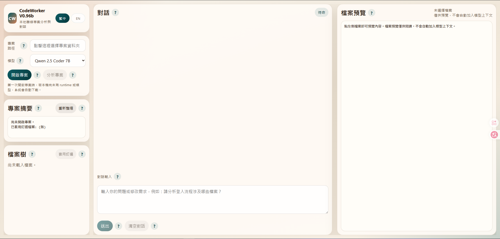

# CodeWorker V0.96b

> 離線、可攜、以隱私與資安為優先的 Windows 本地 AI code assistant。

[English](README.en.md) | [README 首頁](README.md)

`CodeWorker` 是一套可放在 USB 隨身碟上的 **offline AI / local LLM / USB portable** 開發工具。  
它把 `llama.cpp`、`WinPython`、`PortableGit`、GGUF 模型與本地 Web UI 包成一個可攜式工作目錄，適合：

- 客戶端無法上網
- 原始碼不能外流
- 內網或 air-gapped environment
- 需要 on-premise 的 secure code analysis
- 希望在 Windows 本機使用 privacy-first 的 offline coding assistant

---

## 1. 系統需求

- Windows 10 / 11 x64
- 建議至少 16GB RAM
- 建議 CPU 支援 AVX2
- 第一次下載 runtime / 模型時需要網路
- 第一次下載的總檔案大小會超過 5GB，依網路速度與 USB / 硬碟寫入速度不同，可能需要一段時間，請耐心等待
- 若啟用第三模型 `Gemma 4 E4B`，首次下載量與磁碟占用會再增加
- 完成下載後可離線使用

---

## 2. 模型定位

- `Qwen 2.5 Coder 7B`
  - 預設模型
  - 目前最穩定，建議一般使用都先選它
- `Gemma 4 E4B`
  - 可選的評估中模型
  - 已完成 `llama.cpp + GGUF + Windows 本機 + USB` 架構驗證
  - 目前可啟動、可定位，但修改建議穩定性仍弱於 `Qwen`

---

## 3. 安裝方式

### 方式 A：第一次完整準備

```cmd
scripts\bootstrap.cmd
```

這會自動處理：

- 下載 `llama.cpp`
- 下載 `PortableGit`
- 下載 `WinPython`
- 下載預設模型

### 方式 B：如果你要用 CLI agent

```cmd
scripts\install-aider.cmd
```

---

## 4. 最快開始方式

### 啟動 Web UI

```cmd
scripts\launch-webui.cmd
```

開啟：

```text
http://127.0.0.1:8764
```

### Web UI 畫面範例



---

## 5. Web UI 使用流程

1. 點 `專案路徑`
   - 直接選擇你的專案根目錄
2. 確認模型
   - 預設建議先使用 `Qwen 2.5 Coder 7B`
3. 按 `開啟專案`
4. 在 `檔案樹` 勾選你要讓模型讀取的檔案
5. 按 `套用釘選`
6. 在主對話框直接提問或描述修改需求

### 重要規則

- `檔案預覽` 只是閱讀區，不會自動加入模型上下文
- 模型只會根據 **已套用釘選檔案** 來分析與回答
- 若上一版建議有錯，直接在同一個主對話框接著描述問題即可

---

## 6. Web UI 主要功能

### 專案路徑

- 用來選專案根目錄
- 點一下輸入框即可打開 Windows 原生資料夾選取視窗

### 模型

- 切換本次要使用的本地模型
- 切換後要重新 `開啟專案`

### 回應方式

- 主對話框與 `分析專案` 會直接保留較接近模型原始輸出的內容
- 系統不再對這兩條路徑做大幅回覆清洗或風格壓縮
- 模型仍然只會根據 **已套用釘選檔案** 回答

### 開啟專案

- 驗證路徑
- 準備 Git workspace
- 啟動本地模型
- 掃描檔案、入口與測試位置

### 專案摘要

- 顯示專案路徑、檔案數量、主要語言、可能入口與測試位置
- 也會顯示目前已套用的 pinned files

### 檔案樹

- 這裡是唯一的上下文選擇入口
- 勾選檔案後按 `套用釘選`

### 檔案預覽

- 僅供閱讀
- 幫你先確認單一檔案內容

### 對話

- 所有分析、解釋、修改建議與修正迭代都在主對話框內完成

---

## 7. CLI 使用方式

### 啟動本地模型

```cmd
scripts\start-server.cmd
```

切換模型：

```cmd
scripts\start-server.cmd gemma4
```

### 啟動專案級對話

```cmd
scripts\code-chat.cmd C:\path\to\project
```

改用 Gemma 4：

```cmd
scripts\code-chat.cmd C:\path\to\project gemma4
```

---

## 8. 常見使用情境

- 在無法上網的客戶端環境分析專案
- 在 air-gapped environment 中做 local LLM 專案理解
- 用 secure code analysis 方式理解交接專案
- 在 USB portable 工作流中帶著工具到不同 Windows 機器使用

---

## 9. 版本歷程

### V0.96b

- Web UI 與 README 版號同步更新為 `V0.96b`
- 主對話框與 `分析專案` 收斂為較接近模型原始輸出的回應方式
- README 首頁與中英文說明同步更新目前模型定位與回應方式

### V0.95b

- 將當時 repo 內已完成的 `Gemma 4 E4B` 支援與穩定化調整收斂成正式版本
- 同步更新專案版號，作為後續雙語 README 與 UI 語言切換的基線版本
- 新增 README landing page 與中英文文件拆分
- Web UI 新增 `繁中 / EN` 完整語言切換

### V0.94b

- 移除 `修改建議` 的 modal / 獨立視窗
- 所有分析、建議、修正回合都回到主對話框
- 新增 `Gemma 4 E4B` 評估中模型

---

## 10. 重點提醒

- 預設模型仍是 `Qwen 2.5 Coder 7B`
- `Gemma 4 E4B` 目前是評估中可選模型，不建議直接取代 `Qwen`
- 若需要穩定的結構化修改建議，仍優先建議使用 `Qwen`
- README 關鍵字已優化為：
  - offline AI
  - local LLM
  - USB portable
  - secure code analysis
  - air-gapped environment
  - privacy-first

---

## 11. 已知限制

- 目前仍以 Windows 為主
- 第一次下載量大，需耐心等待
- `Gemma 4 E4B` 在 coding / structured edit 上仍弱於更大的模型與 `Qwen`

---

## 12. License

[MIT](LICENSE)
