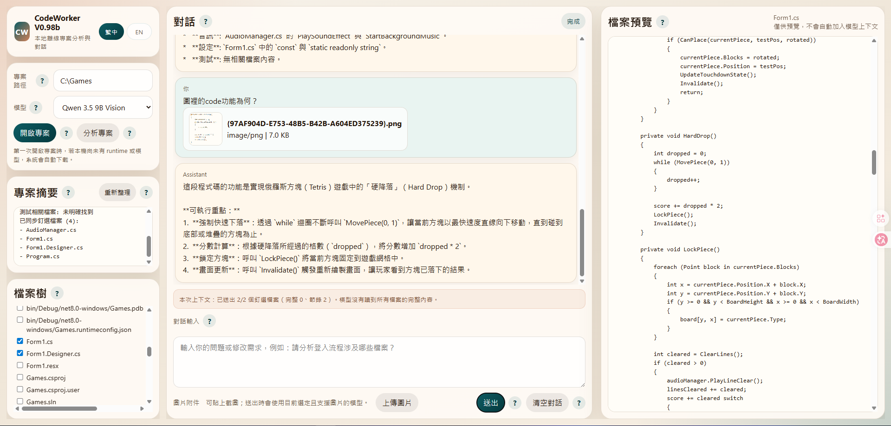
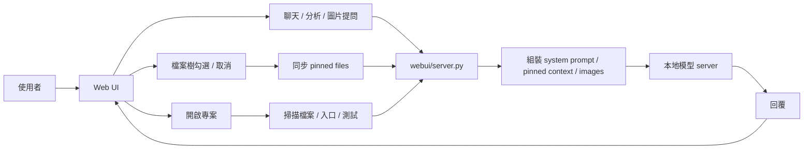

# CodeWorker V0.98b

> 離線、可攜、以隱私與資安為優先的 Windows 本地 LLM 程式碼助理。

[README 首頁](README.md) | [English](README.en.md)

---

## 1. 功能說明

`CodeWorker` 是一套可放在 USB 隨身碟或外接碟中的本機 AI 開發工具，將 `llama.cpp`、`WinPython`、`PortableGit`、GGUF 模型與 Web UI 打包為同一個工作目錄。它適合：

- 客戶端無法上網
- 原始碼不能外流
- 內網、on-premise 或 air-gapped environment
- 需要在 Windows 本機完成 `offline AI` / `local LLM` 專案分析

目前模型定位：

- `Qwen 3.5 9B Vision`
  - 預設與主力模型
  - 支援文字與圖片輸入
  - 主要負責專案分析、程式碼問答、圖像理解與截圖翻譯
- `Gemma 4 E4B`
  - 第二模型
  - 在本專案目前主要用於文字分析
  - 目前沒有列入正式支援的圖片模型

---

## 2. 重點注意事項

- `32GB RAM` 是較穩妥的建議目標，但**不是硬性門檻**
- 若機器使用內顯，共用記憶體會壓縮模型實際可用 RAM
- 第一次下載 runtime / 模型時需要網路，且總下載量會超過 `5GB`
- 新版預設兩模型組合約為 **11.6 GB**
- 舊機器若還留有已移除的 `qwen25` 模型檔，整體工作區仍可能接近 **16.6 GB**
- `檔案預覽` 不會自動成為模型上下文，模型只會根據**已同步釘選檔案**回答
- `Qwen 3.5` 對小到中型 pinned code 組合會優先送完整檔案；若超出預算改用節錄，UI 會顯示 `context coverage`
- 圖片問答目前正式支援 `Qwen 3.5 9B Vision`
- `Gemma 4 E4B` 在本專案中仍應視為文字模型，不應直接把 Ollama Desktop 的圖片表現視為同等支援

GitHub About 建議文案：

- Description：`離線 Windows 本地 LLM 程式碼助理，支援 Qwen 3.5 圖文分析、釘選檔案上下文與隱私優先的本機專案理解。`
- Topics：`offline-ai`, `local-llm`, `windows`, `code-assistant`, `privacy-first`, `llama-cpp`

---

## 3. 安裝方式

### 方式 A：第一次完整準備

```cmd
scripts\bootstrap.cmd
```

這會自動處理：

- 下載 `llama.cpp`
- 下載 `PortableGit`
- 下載 `WinPython`
- 下載預設模型

### 方式 B：如果你要用 CLI agent

```cmd
scripts\install-aider.cmd
```

---

## 4. 使用方式與教學

### 啟動 Web UI

```cmd
scripts\launch-webui.cmd
```

開啟：

```text
http://127.0.0.1:8764
```

### 畫面範例



### 基本操作教學

1. 在 `專案路徑` 選擇你的專案根目錄
2. 在 `模型` 確認目前要使用的模型
3. 點 `開啟專案`
4. 在 `檔案樹` 勾選你要送進模型上下文的檔案
5. 勾選或取消勾選後，釘選狀態會立即同步，不需要再按套用
6. 在主對話框直接提問、描述需求或要求分析

### 圖片輸入教學

1. 點 `上傳圖片`，或直接把截圖貼到聊天輸入區
2. 若目前所選模型支援圖片，請求會用目前模型直接送出
3. 若目前所選模型不支援圖片，Web UI 會顯示明確錯誤
4. 大型截圖會在後端先自動縮圖，再送給 `Qwen 3.5`

### 推薦教學問題

- 「請說明這個專案的入口流程」
- 「請比較 `Program.cs`、`Form1.cs`、`AudioManager.cs` 的職責」
- 「請依照已釘選檔案，說明這段 API 的功能」
- 「請閱讀這張截圖並翻譯成繁體中文」

---

## 5. 檔案結構說明

```text
CodeWorker/
├─ config/        # bootstrap、模型與 aider 設定
├─ docs/          # 截圖與內部文件
├─ downloads/     # 初次下載暫存
├─ logs/          # 啟動與執行記錄
├─ models/        # GGUF 模型與 mmproj
├─ runtime/       # WinPython、PortableGit、llama.cpp
├─ scripts/       # bootstrap、server、Web UI、CLI 啟動腳本
├─ webui/         # Python 後端與靜態前端資源
├─ README.md
├─ README.zh-TW.md
└─ README.en.md
```

重要位置：

- `webui/server.py`：上下文組裝、聊天 API、圖片預處理、模型請求
- `webui/static/app.js`：前端聊天、釘選同步、圖片附件流程
- `webui/static/styles.css`：Web UI 版面與語系樣式
- `scripts\start-server.cmd`：本地模型 server 啟動入口
- `scripts\code-chat.cmd`：CLI 專案對話入口
- `config\bootstrap.manifest.json`：bootstrap 與預設模型設定

---

## 6. 流程架構說明



重點行為：

- `開啟專案` 會做初始化與掃描，但不會自動把整個專案送進模型
- `檔案樹` 是唯一的上下文選擇入口
- `檔案預覽` 只用來看內容，不會直接進入上下文
- 圖片會和文字請求一起進後端，再依模型能力決定是否可執行
- 若上下文不足以送完整檔案，前端會顯示本次是節錄模式

---

## 7. 版本歷程

### V0.98b

- `Qwen 3.5` 完全取代 `Qwen 2.5` 成為預設模型
- Web UI 的圖片提示與 `上傳圖片` / `移除圖片` 控制整併到同一列
- pinned file context 預算上調，小型專案更容易送完整檔案
- 新增 `context coverage` 顯示，明確標示完整檔案或節錄模式
- README 更新為兩模型組合、`11.6 GB / 16.6 GB` 容量差異與最新圖文能力說明

### V0.97b

- 主對話框與 `分析專案` 收斂為較接近模型原始輸出的 `raw-first` 路線
- 修正大型 pinned file 僅剩檔名、內容不足的問題
- 更新 Web UI 與雙語 README 截圖

### V0.96b

- README landing page、中英文文件與 UI 對齊
- 回應方式調整為更接近模型原始輸出

### V0.95b

- 建立 README landing page 與雙語文件分流
- Web UI 新增 `繁中 / EN` 語言切換

### V0.94b

- 移除舊的修改建議 modal
- 所有分析與修正迭代回到主對話框

---

## 8. 版權宣告

本專案採用 [MIT](LICENSE) 授權。

若你在客戶端、內網或 air-gapped environment 使用本工具，仍需自行確認：

- 本地模型與第三方 runtime 的授權條件
- 客戶環境對 USB、可攜式工具與離線 AI 的使用規範
- 你的專案與資料是否允許被本機模型讀取
