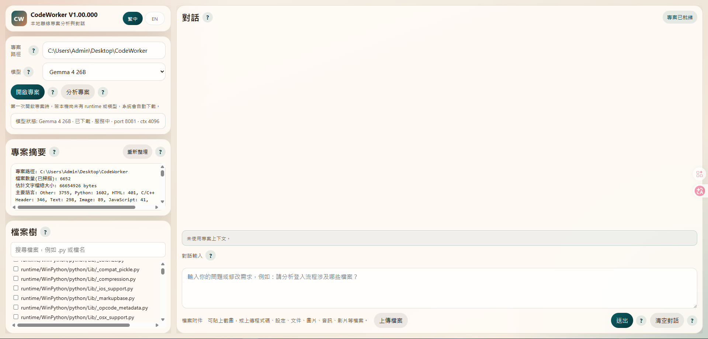
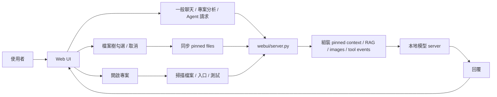

# CodeWorker V1.00.000

> 離線、可攜、以隱私與資安為優先的 Windows 本地 LLM 程式碼助理。

[README 首頁](README.md) | [English](README.en.md)

---

## 1. 功能說明

`CodeWorker` 是一套可放在 USB 隨身碟或外接碟中的本機 AI 開發工具，將 `llama.cpp`、`WinPython`、`PortableGit`、GGUF 模型與 Web UI 打包為同一個工作目錄。它適合：

- 客戶端無法上網
- 原始碼不能外流
- 內網、on-premise 或 air-gapped environment
- 需要在 Windows 本機完成 `offline AI` / `local LLM` 專案分析

目前模型定位：

- `Gemma 4 26B`
  - 預設主力模型
  - 由 CodeWorker 內建 `llama.cpp` service 啟動，不依賴 Ollama
  - 預設使用 Unsloth `UD-Q4_K_M` GGUF；若 `mmproj` 可用，圖片會直接走 native vision，否則降級為文字附件狀態並交由模型回覆限制
- `Qwen 3.5 9B Vision`
  - 可選備用模型
  - 支援文字與圖片輸入
  - 可用於專案分析、程式碼問答、圖像理解與截圖翻譯

---

## 2. 重點注意事項

- `32GB RAM` 是較穩妥的建議目標，但**不是硬性門檻**
- 若機器使用內顯，共用記憶體會壓縮模型實際可用 RAM
- 第一次下載 runtime / 模型時需要網路；`Gemma 4 26B UD-Q4_K_M` 約為 `17GB` 等級，實際大小依 Hugging Face GGUF 檔案而定
- 新版預設兩模型組合會明顯大於舊版 **11.6 GB**，請預留足夠磁碟空間
- 舊機器若還留有已移除的 `qwen25` 模型檔，整體工作區仍可能接近 **16.6 GB**
- 一般聊天不需要先開啟專案，也不需要釘選檔案；沒有專案上下文時會作為一般問答處理
- `檔案樹` 可用來手動釘選精準上下文；未釘選時，只要已開啟專案，一般聊天會走全專案搜尋快取與 RAG
- 專案分析、修改建議、RAG 與 Agent 動作會使用已開啟專案與索引內容
- RAG 會優先回傳實際 source code chunk、檔案路徑與行號；對「哪個檔案」、「哪一段」、「怎麼修改」類問題會降低 README / summary 的優先權
- 小到中型 pinned code 組合會優先送完整檔案；若超出預算改用節錄，UI 會顯示 `context coverage`
- 圖片與其他附件會先嘗試交給目前模型；若目前模型或 `llama.cpp` 設定無法處理，CodeWorker 會降級為文字說明，讓模型明確回覆限制
- 對話改用 streaming 顯示；`reasoning_content` 或 `<think>` 內容會保留在可展開的思考區，展開時會自動跟隨最新輸出
- 一般聊天會帶入壓縮記憶摘要與最近多輪原文對話，讓「上一題」、「剛剛那個檔案」這類追問可以連貫，同時降低 token 使用量

GitHub About 建議文案：

- Description：`離線 Windows 本地 LLM 程式碼助理，支援 Gemma 4 26B、全專案 RAG、附件分析與隱私優先的本機專案理解。`
- Topics：`offline-ai`, `local-llm`, `windows`, `code-assistant`, `privacy-first`, `llama-cpp`

---

## 3. 安裝方式

### 方式 A：第一次完整準備

```cmd
scripts\bootstrap.cmd
```

這會自動處理：

- 下載 `llama.cpp`
- 下載 `PortableGit`
- 下載 `WinPython`
- 下載預設模型

### 方式 B：如果你要用 CLI agent

```cmd
scripts\install-aider.cmd
```

---

## 4. 使用方式與教學

### 啟動 Web UI

```cmd
scripts\launch-webui.cmd
```

開啟：

```text
http://127.0.0.1:8764
```

### 畫面範例



### 基本操作教學

1. 在 `專案路徑` 選擇你的專案根目錄
2. 在 `模型` 確認目前要使用的模型
3. 點 `開啟專案`
4. 需要專案上下文時，在 `檔案樹` 勾選你要送進模型上下文的檔案
5. 勾選或取消勾選後，釘選狀態會立即同步，不需要再按套用
6. 在主對話框直接提問、描述需求或要求分析；若尚未開啟專案，也可以直接作一般問答

### 圖片輸入教學

1. 點 `上傳檔案`，或直接把截圖貼到聊天輸入區
2. 若目前所選模型支援圖片，請求會用目前模型直接送出
3. 若目前所選模型不支援圖片，CodeWorker 會把附件狀態轉成文字提示，讓模型自行回覆限制
4. 大型截圖會在後端先自動縮圖；支援 vision projection 的模型可直接接收圖片

### 推薦教學問題

- 「請說明這個專案的入口流程」
- 「請比較 `Program.cs`、`Form1.cs`、`AudioManager.cs` 的職責」
- 「想更新遊戲速度要怎麼修改？請列出檔案路徑、行號與原因」
- 「請依照已釘選檔案，說明這段 API 的功能」
- 「請閱讀這張截圖並翻譯成繁體中文」

---

## 5. 檔案結構說明

```text
CodeWorker/
├─ config/        # bootstrap、模型與 aider 設定
├─ docs/          # 截圖與內部文件
├─ downloads/     # 初次下載暫存
├─ logs/          # 啟動與執行記錄
├─ models/        # GGUF 模型與 mmproj
├─ runtime/       # WinPython、PortableGit、llama.cpp
├─ scripts/       # bootstrap、server、Web UI、CLI 啟動腳本
├─ webui/         # Python 後端、RAG/Agent 模組與靜態前端資源
├─ README.md
├─ README.zh-TW.md
└─ README.en.md
```

重要位置：

- `webui/server.py`：上下文組裝、streaming chat API、圖片預處理、模型請求
- `webui/core/models.py`：模型 registry、manifest 解析、模型能力與狀態資訊
- `webui/rag/index.py`：本機 hierarchical RAG index、SQLite FTS5 fallback、impact analysis
- `webui/agent/runtime.py`：ReAct-style Agent v1、受控工具呼叫、pending action 與 audit log
- `webui/static/app.js`：前端聊天、釘選同步、檔案附件流程
- `webui/static/styles.css`：Web UI 版面與語系樣式
- `scripts\start-server.cmd`：本地模型 server 啟動入口
- `scripts\code-chat.cmd`：CLI 專案對話入口
- `config\bootstrap.manifest.json`：bootstrap 與預設模型設定

---

## 6. 流程架構說明



重點行為：

- `開啟專案` 會做初始化與掃描，但不會自動把整個專案送進模型
- `檔案樹` 是手動上下文選擇入口；未釘選時，RAG index 會自動提供檢索式上下文
- 圖片會和文字請求一起進後端，再依模型能力直接處理或降級為文字附件狀態
- 若上下文不足以送完整檔案，前端會顯示本次是節錄模式
- 較舊對話會壓縮成 `COMPRESSED CONVERSATION MEMORY`，最近幾輪保留原文；若本輪 RAG / pinned context 與記憶衝突，以本輪專案內容為準
- Agent 的 write、patch、delete、command 類動作必須先產生 pending action，使用者確認後才會執行；audit log 存在 `data/agent-actions.jsonl`

---

## 7. 版本歷程

### V1.00.000

- 預設模型改為 `Gemma 4 26B`，`Qwen 3.5 9B Vision` 保留為可選備用模型
- 新增 bundled FFmpeg runtime，用於影片上傳後依本機硬體評估抽取 keyframes，再交給支援圖片的模型分析
- 新增 bundled `whisper.cpp` speech-to-text pipeline，音訊與影片音軌會先嘗試產生 transcript；若本機沒有 STT backend，UI 與 prompt 會顯示明確狀態
- 移除右側檔案預覽面板，對話區改為單欄寬版；檔案樹點檔名會切換釘選上下文
- 修正長回覆續寫流程：模型只輸出 thinking/reasoning 時會自動要求 final answer，使用者要求「繼續」時會沿用最近對話歷史而不是重新塞入全專案 RAG
- 新增壓縮式對話記憶：所有模型都會收到較舊對話摘要與最近多輪原文，改善追問與上下文連貫並節省 tokens
- 強化 RAG 程式碼定位：中文查詢會展開常見程式命名，例如「遊戲速度」會搜尋 `speed`、`Timer`、`Interval`、`Tick`、`gameSpeed`
- 思考區展開時會自動捲到最新輸出，避免本地模型長時間輸出時畫面停在舊內容
- 影片 metadata-only fallback 會明確禁止模型根據檔名、網址或 metadata 猜測內容
- Gemma4 啟動檢查會確認實際 `model_path` 與 vision `mmproj` 狀態，避免誤用舊模型服務
- 清理舊 Gemma4 模型目錄，保留目前有效的 Unsloth `UD-Q4_K_M` 與 Qwen 備用模型

### V0.98b

- `Gemma 4` 從 E4B 更新為 26B GGUF，改由 CodeWorker 內建 `llama.cpp` service 服務，不依賴 Ollama
- 一般聊天解除「必須開啟專案 / 必須釘選檔案」限制
- 新增 `/api/chat/stream`，完整顯示模型 streaming content 與 reasoning/thinking 輸出
- 新增本機 RAG index、Agent v1 API、pending action 確認與 audit log
- `Qwen 3.5` 在當時取代 `Qwen 2.5` 成為預設模型；`V1.00.000` 起預設模型已改為 `Gemma 4 26B`
- Web UI 的檔案附件提示與 `上傳檔案` / `移除附件` 控制整併到同一列
- pinned file context 預算上調，小型專案更容易送完整檔案
- 新增 `context coverage` 顯示，明確標示完整檔案或節錄模式
- README 更新為兩模型組合、`11.6 GB / 16.6 GB` 容量差異與最新圖文能力說明

### V0.97b

- 主對話框與 `分析專案` 收斂為較接近模型原始輸出的 `raw-first` 路線
- 修正大型 pinned file 僅剩檔名、內容不足的問題
- 更新 Web UI 與雙語 README 截圖

### V0.96b

- README landing page、中英文文件與 UI 對齊
- 回應方式調整為更接近模型原始輸出

### V0.95b

- 建立 README landing page 與雙語文件分流
- Web UI 新增 `繁中 / EN` 語言切換

### V0.94b

- 移除舊的修改建議 modal
- 所有分析與修正迭代回到主對話框

---

## 8. 版權宣告

本專案採用 [MIT](LICENSE) 授權。

若你在客戶端、內網或 air-gapped environment 使用本工具，仍需自行確認：

- 本地模型與第三方 runtime 的授權條件
- 客戶環境對 USB、可攜式工具與離線 AI 的使用規範
- 你的專案與資料是否允許被本機模型讀取
