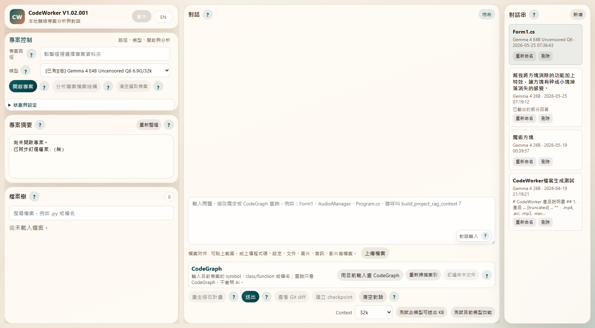
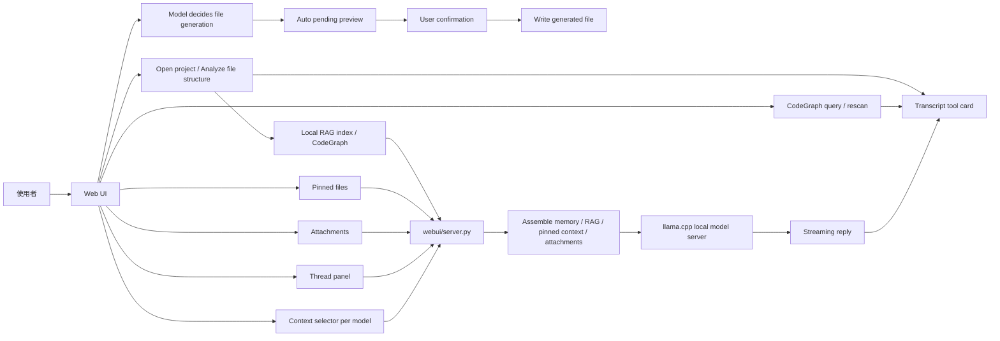

# CodeWorker V1.02.001

> 離線、可攜、以隱私與資安為優先的 Windows 本地 LLM 程式碼助理。

[README 首頁](README.md) | [English](README.en.md)

---

## 1. 功能說明

`CodeWorker` 將 `llama.cpp`、`WinPython`、`PortableGit`、GGUF 模型與 Web UI 整合在同一個 Windows 工作目錄。它適合不能上傳原始碼、不能使用雲端模型，或需要帶到客戶端、內網、air-gapped environment 的開發情境。

主要能力：

- 本機模型服務：初始 fallback 為 `Gemma 4 26B`，之後會把最後一次成功使用的模型作為預設模型；所有模型都由 bundled `llama.cpp` service 啟動，不需要 Ollama。
- 模型下載進度：大型 GGUF 下載會顯示百分比、已下載大小與總大小，讓使用者知道模型仍在下載。
- 多模型選擇：保留 `Gemma 4 26B` 與 `Qwen 3.5 9B Vision`，並新增 `Qwen3.6-35B-A3B Vision`、`Gemma 4 E4B Uncensored Q6`、`Qwen3.6-35B-A3B Uncensored IQ2_M`、`Qwen3-Coder 30B A3B`、`GLM-4.6`、`Qwen2.5-Coder 14B Instruct`、`DeepSeek-Coder V2 Lite`。
- 硬體自動最佳化：Web UI 會偵測 RAM、CPU、GPU vendor、VRAM、`nvidia-smi` 與 Vulkan 可用性，推薦模型並套用 backend、context、threads、GPU layers 與 8GB NVIDIA MoE offload 參數；效能測試後會寫入本機硬體匹配設定檔供下次沿用。
- Context 下拉選單：每個模型可獨立選擇自己的 context options，支援 `4k` 到 `256k`，`GLM-4.6` 另支援 `200k` 選項。
- Context 容量實測：可針對目前模型測試可送出的 KB 上限，結果寫入本機 `data\model-context-calibration.json`，後續修改計畫會優先使用實測 `structuredEditChars`。
- 完整檔案上下文：pinned files 與 resolver 鎖定檔案若低於模型實測容量，會以完整檔案送出；放不下時才逐步降為完整函式 / class region，再降為 line windows。
- 修改計畫診斷：每次 `產生修改計畫` 會顯示 context coverage；無法安全產生 patch 時會降級為 `未驗證參考片段`，不顯示可直接套用 action。
- 全專案檢索：開啟專案後，即使沒有 pinned files，也會使用本機 RAG index 搜尋相關檔案、symbols、summary 與 chunks。
- CodeGraph 式語意索引：RAG 重建時會同步建立 `code_nodes`、`code_edges` 與 `code_unresolved_refs`，提供 symbol entry points、imports、calls、extends 與 impact navigation。
- 分析專案檔案結構：以 deterministic 多語言分類找出入口、核心程式、專案設定、UI、資源、測試與可忽略產物，作為釘選前的篩選工具。
- 單一訊息流：AI 回答、專案結構分析、CodeGraph 查詢、context coverage 與檔案生成確認都保存在同一個 transcript，可以在同一個區塊上下捲動回看。
- 忙碌狀態提示：AI 回答、streaming 與 `產生修改計畫` 期間會顯示 spinner / busy bar，讓使用者知道模型仍在工作。
- Codex plugin：新增 `plugins\codeworker-codegraph`，可安裝到 Codex 後用 skill/script 查 CodeWorker 本機 graph，再決定要讀哪些檔案。
- 聚焦上下文：在 `檔案樹` 勾選檔案時，pinned files 會優先於全專案 RAG。
- 附件分析：支援程式碼、設定、文件、圖片、音訊與影片；可抽文字、keyframes 或 transcript 時會送入模型，否則送 metadata fallback。
- 多對話串：右側 `240px` thread panel 可新增、切換、重新命名、刪除對話串，每個 thread 保留自己的 history、memory 與 transcript。
- 模型主導檔案生成：在一般對話中要求產生文件即可，模型會先產生內容與標題，CodeWorker 依模型標題自動命名並建立 pending preview；確認後才寫入 `.txt/.md/.py/.js/.ts/.json/.html/.css/.yaml/.sql/.cs/.docx/.pdf/.pptx/.xlsx`。
- Agent 安全機制：寫檔、patch、刪檔、rename 與執行 command 前都會建立 pending action，使用者確認後才執行；套用前會建立 Git checkpoint，套用後若有檔案變更會建立 post checkpoint，可查看 diff 並復原這次修改。

---

## 2. 重點注意事項

- 第一次執行需要網路下載 runtime 與模型；完成後可離線使用。
- `Qwen3.6-35B-A3B Vision`、`Qwen3-Coder 30B A3B`、`GLM-4.6`、`Qwen2.5-Coder 14B Instruct`、`DeepSeek-Coder V2 Lite` 不會在第一次 bootstrap 時自動下載，需由使用者選定模型後再下載。
- `Qwen3.6-35B-A3B Vision` 的 8GB NVIDIA profile 需要足夠 system RAM；目前設定會依硬體在 `32k` / `64k` context 間選擇，使用 `q4_0` KV cache、`--n-cpu-moe=999`、`--flash-attn`、`--jinja`、`--batch-size=512`、`--ubatch-size=128` 與必要的 GPU offload 參數，將 MoE weights 留在 CPU/RAM 並以 CUDA offload 非 MoE layers。
- 沒有獨立顯卡也可以用 `Qwen3.6-35B-A3B Vision` 的 CPU-only 模式，但需要更高 system RAM、較小 context 與較長等待時間；詳細設定在 [docs\qwen36a3b-cpu-only-llamacpp.md](docs/qwen36a3b-cpu-only-llamacpp.md)，README 摘要見第 4 節的 [Qwen3.6-35B-A3B CPU-only llama.cpp 設定](#qwen36-35b-a3b-cpu-only-llamacpp-設定)。
- `256k` context 是可選上限，不代表每台機器都能穩定跑滿；若模型啟動失敗，UI 會顯示錯誤與 log path，不會自動降級。
- 建議至少 `32GB RAM` 等級；大型 context、圖片、影片 keyframes 與長回答都會增加記憶體壓力。
- 高階模型與 GPU backend 尚需在高階硬體實機驗證；測試時請保留 `logs\hardware-optimization.jsonl` 與對應的 `logs\llama-server-<model>-*.log` / `.err.log`。
- 未開啟專案時只做一般問答；已開啟專案且未釘選檔案時使用全專案 RAG；有 pinned files 時優先使用 pinned context。
- 影片不是直接把 MP4 binary 丟給模型，而是先用 `FFmpeg` 抽 keyframes；音訊與影片音軌會嘗試 `whisper.cpp` speech-to-text。
- 檔案生成與 Agent 寫入都必須確認後才會落到 project root；生成完成後 UI 會顯示實際檔案路徑與檔名。
- `產生修改計畫` 會先建立可審查的檔案操作清單；`確認套用` 前會建立 Git checkpoint，套用後若有檔案變更會建立 post checkpoint，`查看 Git diff` 可比對變更，必要時可 `復原這次修改`。
- CodeGraph 功能參考 `colbymchenry/codegraph` 的本機語意索引做法；出處、作者與授權資訊列於 [THIRD_PARTY_NOTICES.md](THIRD_PARTY_NOTICES.md)。

---

## 3. 安裝方式

### 第一次完整準備

```cmd
scripts\bootstrap.cmd
```

這會依 `config\bootstrap.manifest.json` 準備：

- `llama.cpp`
- `WinPython`
- `PortableGit`
- `FFmpeg`
- `whisper.cpp` 與 speech-to-text model
- `Gemma 4 26B` / `Qwen 3.5 9B Vision` GGUF 與 `mmproj`
- Python 文件套件：`pypdf`、`pdfplumber`、`python-docx`、`reportlab`、`python-pptx`、`openpyxl`

### 更新現有安裝

```cmd
git pull
scripts\bootstrap.cmd
scripts\launch-webui.cmd
```

更新檢查重點：

1. Web UI 左上角應顯示 `CodeWorker V1.02.001`。
2. `scripts\bootstrap.cmd` 會補齊 runtime、Python packages、模型 manifest 與既有下載項目，不會重複下載已存在且校驗通過的檔案。
3. `scripts\launch-webui.cmd` 會重新啟動 `http://127.0.0.1:8764`；若 port 上已有舊的 CodeWorker Web UI，會先回收舊 process。
4. 開啟專案後可執行 `分析專案檔案結構`、`用目前輸入查 CodeGraph`、`重新掃描索引` 與一般聊天，結果都會出現在同一個 transcript。

### 啟動 Web UI

```cmd
scripts\launch-webui.cmd
```

開啟：

```text
http://127.0.0.1:8764
```

### 選用 CLI agent

```cmd
scripts\install-aider.cmd
```

---

## 4. 使用方式與教學

### 畫面範例



畫面顯示目前主要工作區：專案控制入口、`清空選取專案`、專案摘要與虛擬化檔案樹、單一對話流、輸入區 / CodeGraph / Git 修改操作，以及右側對話串管理。

### 一般問答

1. 啟動 Web UI。
2. 不必開啟專案，直接在主對話框提問。
3. 此模式不會加入 `PROJECT RAG CONTEXT`、pinned files 或 file tree。
4. 如果已開啟專案，按 `清空選取專案` 可清除目前 project context，但保留模型與對話紀錄。

### 專案搜尋與問答

1. 在 `專案路徑` 選擇專案根目錄。
2. 點 `開啟專案`。
3. 需要先整理大量檔案時點 `分析專案檔案結構`；若要回到一般問答，點右側的 `清空選取專案`。
4. 直接詢問「在哪個檔案」、「哪段 code」、「要怎麼修改」；沒有 pinned files 時會自動用 RAG 搜尋全專案。
5. 若要聚焦少數檔案，在 `檔案樹` 勾選檔名。

### 分析專案檔案結構與釘選

1. 開啟專案後按 `分析專案檔案結構`。
2. CodeWorker 會依不同語言與工具鏈分類入口、核心 source、project configs、UI/form、assets、tests、generated files 與 build outputs。
3. 結果會以 transcript tool card 顯示，不會覆蓋聊天紀錄。
4. 按 `一鍵釘選建議檔案` 可把入口、設定、核心程式與 UI/測試檔加入 pinned files，再讓 AI 分析或修改。

### CodeGraph 關聯查詢

CodeGraph 適合在「還不知道要釘選哪些檔案」或「修改前想確認影響範圍」時使用。

1. 在對話輸入框輸入目前專案的 symbol、class/function、檔名或問題，例如 `Form1`、`AudioManager`、`Program.cs`、`誰呼叫 build_project_rag_context？`。
2. 按 `用目前輸入查 CodeGraph`。這一步只查本機 SQLite graph，不會問 AI。
3. transcript 會顯示命中 symbols、relationships、matched files、nodes/edges/unresolved 與下一步提示。
4. 若結果符合目標，按 `釘選命中文件`，再按一般 `送出`，AI 就會用這些 pinned files 回答。
5. 若查不到新檔案或新 symbol，按 `重新掃描索引`。它會重建 RAG + CodeGraph index，完成後保留重建摘要；若輸入框仍有 query，會再追加一張查詢結果卡。

優點：

- 先找 symbol 與關聯，再決定讀哪些檔案，降低大型專案中亂翻檔案的成本。
- 可在修改前檢查 callers/callees/imports/extends，避免漏掉受影響位置。
- 全程本機 SQLite 與本機模型，不需要 API key，也不會把專案送到雲端。
- 與 `分析專案檔案結構` 搭配時，先用檔案分類縮小範圍，再用 CodeGraph 查 symbol 關聯。

### 單一訊息流與 streaming 閱讀

- 對話、工具結果、CodeGraph、專案結構分析、context coverage 與檔案確認都會存在同一個 transcript。
- AI streaming 時，只有使用者停在底部附近才會自動跟隨；如果你往上捲閱讀舊內容，畫面不會被強制拉回底部。
- 切換 thread 或重新整理頁面後，chat 與 tool cards 會從 persisted `transcript` 回放；舊 thread 若沒有 `transcript`，會從既有 `history` 自動轉成基本顯示。

### 安裝 CodeWorker CodeGraph Codex plugin

CodeWorker 也提供 repo-local Codex plugin：

```cmd
codex plugin install plugins\codeworker-codegraph
```

安裝後，在 Codex 裡可使用 `codeworker-codegraph` skill。常用查詢：

```powershell
runtime\WinPython\python\python.exe C:\Users\Admin\.codex\skills\codeworker-codegraph\scripts\query_codeworker_graph.py --project C:\path\to\project --status
runtime\WinPython\python\python.exe C:\Users\Admin\.codex\skills\codeworker-codegraph\scripts\query_codeworker_graph.py --project C:\path\to\project --rebuild --query "Form1"
runtime\WinPython\python\python.exe C:\Users\Admin\.codex\skills\codeworker-codegraph\scripts\query_codeworker_graph.py --project C:\path\to\project --query "AudioManager callers" --json
```

使用情境：

- 要修改功能前，先查相關 symbol 與呼叫關係。
- 要交接陌生專案時，先用 graph 找入口與核心檔案。
- 要讓 Codex 減少無目的 `rg` / `Read`，先用 graph 當導航圖，再讀目標檔案。

推薦問題：

- 「請問加載 model 的 code 在哪個檔案的哪一段？」
- 「想更新遊戲速度要怎麼修改？請列出檔案路徑與原因。」
- 「我加入網路連線對戰，第一步要改哪些檔案？」

### Context 設定

1. 在聊天輸入區底部的 `Context` 下拉選單選擇 `4k` 到 `256k`。
2. 每個模型會記住自己的選擇。
3. 如果現有 `llama-server` context 低於目前選擇，下一次啟動模型時會用新 context 重啟。
4. 按 `測試此模型可送出 KB` 可實測目前模型與 context 的輸入上限；成功後會寫入本機 `data\model-context-calibration.json`，Web UI 不會提交這個本機校準檔。
5. `產生修改計畫` 會優先使用實測 `structuredEditChars`；若沒有校準資料，才使用保守估算。
6. 若 `256k` 或大 context 在本機失敗，請看左側錯誤區與 `logs/llama-server-*.err.log`。

### Qwen3.6-35B-A3B CPU-only llama.cpp 設定

完整設定文件位置：[docs\qwen36a3b-cpu-only-llamacpp.md](docs/qwen36a3b-cpu-only-llamacpp.md)。本節只列最常用的 CPU-only 啟動方式；需要 CodeWorker 自動啟動方式、低記憶體調整與排錯位置時，請看該文件。

`Qwen3.6-35B-A3B Vision` 可在無獨立顯卡或不想使用 GPU 時以 CPU-only 方式啟動，但這不是 8GB 顯卡最佳化模式；它會更慢，也更依賴 system RAM。建議先用 `16k` 或 `32k` context 測試，穩定後再提高。

```cmd
runtime\llama.cpp\llama-server.exe ^
  -m models\qwen3.6-35b-a3b-ud-q4-k-m\Qwen3.6-35B-A3B-UD-Q4_K_M.gguf ^
  --mmproj models\qwen3.6-35b-a3b-ud-q4-k-m\mmproj-BF16.gguf ^
  --host 127.0.0.1 ^
  --port 8087 ^
  --ctx-size 32768 ^
  --cache-type-k q4_0 ^
  --cache-type-v q4_0 ^
  --threads 12 ^
  --n-gpu-layers 0 ^
  --n-cpu-moe 999 ^
  --batch-size 256 ^
  --ubatch-size 64 ^
  --jinja
```

設定與注意事項：

- `--n-gpu-layers 0`：明確禁止 GPU offload。
- `--n-cpu-moe=999`：MoE layers 保留在 CPU/RAM。
- `--ctx-size 32768`：先用 `32k`；RAM 不足時降到 `16384` 或 `8192`。
- `--cache-type-k q4_0 --cache-type-v q4_0`：降低 KV cache 記憶體需求。
- `--batch-size 256 --ubatch-size 64`：比 8GB NVIDIA profile 更保守，適合 CPU-only 測試。
- `--mmproj` 只有需要圖片理解時才保留；純文字 / 程式碼修改可先省略。
- CPU-only 不建議預設加 `--mlock`；除非 RAM 很充足，否則可能讓 Windows 更難回收記憶體。
- GGUF 約 21GB 等級，CPU-only 建議至少 `64GB RAM`；`32GB RAM` 可能非常慢或直接失敗。
- 失敗時先看 `logs\llama-server-qwen36a3b-*.err.log` 與 `logs\hardware-optimization.jsonl`。

### 產生修改計畫與完整檔案上下文

1. 優先在 `檔案樹` 勾選明確相關檔案；多個 pinned files 只要總量低於目前模型的實測容量，就會完整送出。
2. 未釘選或釘選不足時，CodeWorker 會用 project structure、RAG 與 CodeGraph 鎖定候選檔案與 symbol。
3. 若完整檔案放不下，才退到完整函式 / class region；再放不下才使用 line windows。
4. transcript 的 `本次上下文` / `修改計畫上下文` 會列出每個檔案是 `完整`、`區域` 或 `片段`，也會顯示送出大小與是否截斷。
5. 若模型輸出不能被本機唯一定位，UI 會顯示 `未驗證參考片段` 並禁用套用；只有後端驗證成功的 `actions` 才能 `確認套用`。

### 對話串

- 右側 `對話串` 可新增、切換、重新命名與刪除 thread。
- 每個 thread 保存自己的 `history`、`memory_summary`、`modelKey` 與 `projectPath`。
- `清空對話` 只清目前 thread，不會清掉其他 thread。

### 附件分析

1. 點 `上傳檔案`，或把截圖貼到聊天輸入區。
2. 可上傳程式碼、設定檔、PDF、DOCX、圖片、音訊與影片。
3. 圖片會先嘗試 native vision；影片會先抽 keyframes；音訊會嘗試 speech-to-text。
4. 若 extractor 或 native payload 不可用，CodeWorker 會送 metadata 與限制說明，不會假裝已看見內容。

### 檔案生成

1. 開啟專案。
2. 直接用一般聊天要求模型生成檔案，例如：「我要生成一個專案功能介紹的 PPT 文件」。
3. 模型會先產生文件內容，第一行標題會作為自動命名依據；CodeWorker 會用這份回覆建立 pending preview。
4. 若要把上一則回答輸出成文件，可以直接寫：「把剛剛的說明與使用場景做成一個 PPTX 跟 PDF 檔」或「幫我把說明生成 Word 檔」。
5. 若同一則訊息已貼上完整 Markdown 內容，例如「請把上面的內容生成docx檔給我」後接 `# 標題`，CodeWorker 會直接建立 pending preview，不再呼叫模型重寫內容。
6. 若要求「把上面的內容 / 剛剛的回答 / 上一則回答」生成文件，CodeWorker 會直接取上一則 assistant 可見回答建立 preview，不再呼叫模型。
7. 若同一句話提到多個格式，CodeWorker 會建立多個 pending preview，例如 `.pptx` 與 `.pdf` 各一個。
8. Word 請寫明 `Word`、`word檔`、`docx` 或 `docx檔`，例如：「請把剛剛的回答生成word檔」。
9. 純文字與程式碼可直接寫副檔名或格式別名，例如 `txt檔`、`md檔`、`py檔`、`js檔`、`json檔`、`html檔`、`css檔`、`yaml檔`、`sql檔`、`cs檔`。
10. Excel 請寫明 `Excel`、`xlsx`、`試算表` 或目標副檔名，例如：「把測試清單做成 Excel 試算表」。
11. 檢查 pending preview 後按「確認寫入」；寫入完成後，對話中會顯示絕對路徑、相對路徑與檔案大小。若檔案沒有實際落檔，後端會回錯，不會顯示成功。

---

## 5. 檔案結構說明

```text
CodeWorker/
├─ config/        # bootstrap、模型 registry 與 aider 設定
├─ data/          # RAG indexes、chat threads、本機 context 選擇與 audit log
├─ docs/          # 截圖、內部文件與測試筆記
├─ downloads/     # bootstrap 下載暫存
├─ logs/          # Web UI、model server 與 context bench log
├─ models/        # GGUF 模型與 mmproj
├─ runtime/       # WinPython、PortableGit、llama.cpp、FFmpeg、whisper.cpp
├─ scripts/       # bootstrap、模型解析、server 啟動與回歸測試
├─ webui/         # Python 後端、RAG/Agent 模組與前端資源
├─ plugins/       # Codex plugin，例如 codeworker-codegraph
├─ THIRD_PARTY_NOTICES.md
├─ README.md
├─ README.zh-TW.md
└─ README.en.md
```

重要檔案：

- `config\bootstrap.manifest.json`：runtime、模型來源、`contextWindow`、KV cache type、`mmproj` 與預設設定。
- `scripts\resolve_model_env.py`：依 manifest 解析模型檔、port、context、KV cache type 與 `mmproj`。
- `scripts\launch_llama_server.py`：啟動 bundled `llama.cpp` model server。
- `scripts\run_webui_regression.py`：Web UI、附件、RAG 與 streaming 回歸測試。
- `webui\server.py`：API routes、streaming chat、context assembly、threads、file generation、attachment handling、memory 與 model call。
- `webui\core\hardware.py`：偵測硬體 profile、選擇 backend、推薦模型與產生自動最佳化設定。
- `webui\core\models.py`：模型 registry、狀態與 OpenAI-compatible endpoint 資訊。
- `webui\rag\index.py`：hierarchical project index、SQLite FTS5 fallback、chunk search 與 impact hints。
- `webui\rag\code_graph.py`：CodeGraph-style symbol graph、relationship edges、graph search 與 compact graph context。
- `webui\agent\runtime.py`：ReAct-style Agent、tool calls、pending actions 與 audit log。
- `webui\static\js\app-*.js`：前端 state、API、UI、檔案樹、threads、chat、CodeGraph 與初始化流程。
- `webui\static\styles.css`：450px sidebar、單一 transcript chat、輸入區與 240px thread panel。
- `plugins\codeworker-codegraph`：repo-local Codex plugin，內含 `codeworker-codegraph` skill 與 `query_codeworker_graph.py` 查詢工具。
- `THIRD_PARTY_NOTICES.md`：第三方出處、作者與授權註記。

---

## 6. 流程架構說明


```mermaid
flowchart LR
    U["使用者"] --> W["Web UI"]
    W --> K["Context selector per model"]
    W --> T["Thread panel"]
    W --> O["Open project / Analyze file structure"]
    O --> I["Local RAG index / CodeGraph"]
    W --> X["CodeGraph query / rescan"]
    W --> P["Pinned files"]
    W --> F["Attachments"]
    W --> G["Model decides file generation"]
    I --> S["webui/server.py"]
    P --> S
    F --> S
    T --> S
    K --> S
    G --> A["Auto pending preview"]
    O --> H["Transcript tool card"]
    X --> H
    A --> Q["User confirmation"]
    Q --> D["Write generated file"]
    S --> C["Assemble memory / RAG / pinned context / attachments"]
    C --> M["llama.cpp local model server"]
    M --> R["Streaming reply"]
    R --> H
```

流程重點：

- 沒有開啟專案時，chat payload 只包含使用者問題、附件與對話記憶。
- 開啟專案但沒有 pinned files 時，RAG index 會依問題搜尋相關檔案、symbols、summary 與 chunks。
- `分析專案檔案結構` 與 CodeGraph 查詢只寫入 `transcript`，不會被送進模型 history。
- 有 pinned files 時，會優先使用 pinned context。
- 長回答續寫使用上一段回答 tail，不再重送大型 `PROJECT RAG CONTEXT`。
- 檔案生成由一般聊天觸發；模型先產生內容與標題，CodeWorker 再建立 pending preview。同一句多格式需求會建立多個 preview，文件輸出會清理 Markdown 標記並使用可顯示中文的 PDF 字型。

CodeGraph 出處：

- 原始專案：[`colbymchenry/codegraph`](https://github.com/colbymchenry/codegraph)
- 作者 / copyright holder：Colby Mchenry
- 授權：MIT License
- CodeWorker 實作：參考其「本機 symbol graph + relationships + SQLite」工作流，改寫為 Python-native lightweight implementation，詳見 [THIRD_PARTY_NOTICES.md](THIRD_PARTY_NOTICES.md)。

---

## 7. 版本歷程

### V1.02.001

- 將 Web UI 與啟動檢查版本推進到 `CodeWorker V1.02.001`，同步更新 `VERSION`、`/api/status`、`scripts\launch-webui.cmd`、前端顯示文字與 README 截圖。
- 新增 `清空選取專案` 按鈕，放在 `分析專案檔案結構` 右側；可清除 project path、summary、file tree、pinned files、preview 與 pending edit，保留目前模型與對話紀錄，讓同一個 thread 回到一般問答模式。
- 新增 `Gemma 4 E4B Uncensored Q6` 與 `Qwen3.6-35B-A3B Uncensored IQ2_M` 模型 catalog / manifest / resolver 設定，包含獨立 port、context options、matching `mmproj` 與 `--jinja` 啟動參數。
- 強化硬體最佳化與模型效能測試：`/api/models`、`/api/status`、`/api/hardware/optimization` 會回傳一致的 `optimizationPlan`，效能測試結果會寫入本機 `data\model-performance-calibration.json` 與 `data\hardware-model-profiles.json`，下次遇到相同或相容硬體時可套用匹配設定。
- 針對 CPU-only / shared-memory iGPU 的大型模型啟動改用保守設定，加入 `--no-repack`、較小 batch / ubatch 與 adaptive startup timeout，避免用固定過短 timeout 誤判本機模型啟動失敗。
- 擴充 regression，覆蓋清空專案、兩個新增 HauhauCS 模型、硬體 profile matching、performance-test 寫入設定檔、低記憶體啟動參數、adaptive timeout 與前端 `/api/project/clear` 呼叫。

### V1.02.000

- 將 Web UI 與啟動檢查版本推進到 `CodeWorker V1.02.000`，同步更新 `VERSION`、`/api/status`、`scripts\launch-webui.cmd`、前端顯示文字與 README 截圖。
- 新增 last-used model preference：模型成功用於開啟專案、chat、model ensure、context 校準或 `產生修改計畫` 後，會寫入本機 `data\model-preferences.json`，下次啟動與新專案預設使用最後一次模型；無效或缺檔時 fallback 到 `gemma4`。
- `產生修改計畫` 前端會送出目前下拉選到的 `modelKey`，後端會用該模型建立 edit context、必要時啟動模型，成功後同步更新 last-used default。
- 新增 context calibration 工作流，支援 enabled models 與 `qwen36a3b`，校準結果寫入 `data\model-context-calibration.json`；`/api/models` 會回傳 `calibrated`、`structuredEditChars` 與 `measuredAt`。
- 重寫 edit target resolver 與 context assembly：pinned files 優先，可納入多檔；無 pinned 時用 project structure、RAG 與 CodeGraph 鎖定候選；容量允許時送完整檔案，否則依序退到完整 member region 與 line windows。
- 每次修改計畫都產生 context coverage，顯示送出檔案、`full/region/window` 模式、送出大小、總大小、是否截斷與漏掉候選。
- precise patch validation 失敗也會寫入 raw reply log；advisory suggestion 會標記 `verified=false`、`source="model-unverified"`、`failureReason` 與 `missingSearchSnippet`，UI 以 `未驗證參考片段` 呈現並禁用 apply。
- `call_local_model()` 支援 streaming collection，修改計畫與 advisory fallback 可保留 partial reply log，降低長推理被 timeout 誤判成無內容的機率。
- 新增 Qwen 模型請求選項，`qwen36a3b` 預設送出 `enable_thinking=false`，避免 visible answer 混入模型 thinking template。
- 補充 `Qwen3.6-35B-A3B Vision` CPU-only `llama.cpp` 設定教學，說明 `--n-gpu-layers 0`、`--n-cpu-moe=999`、低 batch、KV cache、context 降級與 `--mlock` 注意事項。
- 擴充 regression，覆蓋 last-used default、edit plan 指定模型、完整 pinned file context、多 pinned files、RAG/CodeGraph resolver、calibration budget、advisory UI、raw reply log 與 timeout streaming fallback。

### V1.01.003

- 將 Web UI 與啟動檢查版本推進到 `CodeWorker V1.01.003`，同步更新 `VERSION`、`/api/status`、`scripts\launch-webui.cmd` 與前端顯示文字。
- 更新 README 與中英文註解截圖，標出專案控制入口、專案摘要、虛擬化檔案樹、單一對話流、AI 忙碌指示、CodeGraph、Git 修改與對話串管理。
- 重新整理 Web UI 版面密度：`專案控制` 改為可折疊區塊，sidebar 改成 flex layout，修正隱藏錯誤區造成的多餘間距，並縮小按鈕、輸入框、label、標題與對話訊息卡片。
- 將 `對話輸入` 說明移到 textarea 右下角，讓 `Context` 下拉與主要 action buttons 不再擠在同一個 label row。
- 模型下載進度會依實際檔案大小顯示百分比、已下載大小與總大小，例如 `38% (3.4 GB / 9.0 GB)`，避免大型 GGUF 下載時看起來像程式卡住。
- AI 回答、streaming 與 `產生修改計畫` 期間會顯示 spinner / busy bar，結束後自動清除，並保留可由 E2E 檢查的 busy state。
- 新增 `Qwen3.6-35B-A3B Vision` 模型選項，使用 `unsloth/Qwen3.6-35B-A3B-GGUF` 的 `UD-Q4_K_M` 與 `mmproj-BF16.gguf`，並在 64GB RAM + RTX 3070 8GB 等級硬體上推薦。
- `scripts\launch_llama_server.py` 與 Web UI 啟動流程新增 `--n-cpu-moe`、`--batch-size`、`--ubatch-size`、`--mlock` 白名單，讓 manifest 可套用 8GB NVIDIA MoE offload 啟動參數。
- 修正不存在的 project/thread path 造成舊路徑殘留或 UI 卡住的問題；失敗時會清空 stale project state 並回到 idle。
- 針對本地 coding models 放寬 `產生修改計畫` timeout，避免低速 PC 上還在正常推理就被過早中斷。
- 補強 regression 與 browser E2E，覆蓋版本顯示、模型下載進度、AI busy indicator、CodeGraph、Git 修改 action 與 responsive layout。

### V1.01.002

- 將 Web UI 版本更新為 `CodeWorker V1.01.002`。
- 新增本地檔案修改工作流：`產生修改計畫`、pending action card、`確認套用`、`查看 Git diff`、`建立 checkpoint` 與 `復原這次修改`。
- 新增 Git safety layer，檔案修改套用前建立 pre-edit checkpoint，套用後若有檔案變更建立 post-edit checkpoint，並限制 restore 只能回到 CodeWorker 建立的 pre-edit checkpoint。
- 新增 `/api/edit/apply`、`/api/edit/status`、`/api/git/diff`、`/api/git/checkpoint`、`/api/git/restore`，支援 `create_file`、`patch_file`、`replace_file`、`delete_file`、`rename_file`、`run_command` pending actions。
- 將對話、AI streaming、專案結構分析、CodeGraph 查詢 / 重建、context coverage 與檔案生成確認整合到單一 transcript scroll container。
- 新增 persisted `transcriptVersion: 1` 與 `transcript` thread data；舊 thread 會從既有 `history` fallback 顯示。
- 保留 `history` 作為模型上下文來源，工具卡與狀態卡只進 `transcript`，避免 CodeGraph / 分析結果被誤送進 LLM。
- `分析專案` 重新定位為 `分析專案檔案結構`，用於釘選前分類入口、核心程式、project configs、UI/form、assets、tests、generated files 與 build outputs。
- 擴充多語言分類，納入 Delphi / Object Pascal、C、C++、VB、.NET、JS/TS、Python、Java/Kotlin、Go、Rust、PHP、Ruby 與常見資源目錄。
- CodeGraph 工具列改為使用對話輸入框查詢，查詢結果、no-match 建議、matched files、重建摘要與釘選回饋都插入 transcript。
- 新增 `/api/project/structure`、`/api/codegraph/status`、`/api/codegraph/query` 與 `POST /api/threads/cleanup-empty` 相關 regression coverage。
- 正式加入 `scripts\run_webui_e2e.mjs` 與 `scripts\run_webui_e2e.cmd`，覆蓋 3 輪 browser E2E、thread cleanup、CodeGraph、file tree virtualization、busy indicator 與 responsive layout。
- 新增 `THIRD_PARTY_NOTICES.md`，註明 `colbymchenry/codegraph` 的出處、作者 Colby Mchenry 與 MIT License。
- 新增 V1.01.002 中英文 Web UI 截圖，README 使用最新工作內容畫面。

### V1.01.001

- 新增高階模型選項 `Qwen3-Coder 30B A3B` 與 `GLM-4.6`，以及低階 / 標準備援 `Qwen2.5-Coder 14B Instruct` 與 `DeepSeek-Coder V2 Lite`。
- 新增硬體偵測與自動最佳化設定，會依 RAM、CPU threads、GPU vendor、VRAM、`nvidia-smi` 與 Vulkan 可用性推薦模型、backend、context、threads 與 `--n-gpu-layers`。
- `/api/models` 會回傳 `hardwareProfile`、`recommendedModelKey`、各模型 tier、估計模型大小、runtime backend、GPU layers 與 threads。
- Web UI 模型下拉選單會顯示 tier、模型大小、context 與推薦資訊，左側新增硬體偵測狀態區。
- `scripts\launch_llama_server.py` 支援 `--n-gpu-layers`、`--flash-attn` 與 `--jinja`，不再固定 CPU-only。
- 新增 `logs\hardware-optimization.jsonl` 詳細記錄硬體 profile、模型推薦、啟動計畫、實際 backend、context、threads、GPU layers、模型檔路徑與 log path。
- 每次 `llama-server-*.log` 開頭會寫入 `[CODEWORKER_LAUNCH_METADATA]`，方便回查實際 command 與 llama.cpp 啟動參數。
- 新增 CodeGraph-style 本機語意索引，在 RAG index 內建立 `code_nodes` / `code_edges` / `code_unresolved_refs`，讓模型上下文先取得 symbol 與 relationship map。
- 新增 `plugins\codeworker-codegraph` Codex plugin，可安裝後用 `codeworker-codegraph` skill 與 `query_codeworker_graph.py` 查 CodeWorker 本機 graph。
- 高階硬體尚待實機驗證：CUDA / Vulkan runtime 選擇、`Qwen3-Coder 30B A3B`、`GLM-4.6`、大 context 與 GPU offload 穩定性需由高階 PC 測試後回傳 log 確認。

### V1.01.000

- 新增每模型獨立 `Context` 下拉選單，固定支援 `4k / 8k / 16k / 32k / 64k / 128k / 256k`。
- `Gemma 4 26B` 與 `Qwen 3.5 9B Vision` 預設 context 改為 `256k`，啟動時傳入 `llama-server -c 262144`。
- 新增 KV cache type 設定，預設 `cacheTypeK=q4_0`、`cacheTypeV=q4_0`。
- 新增右側 `240px` 對話串面板，支援新增、切換、重新命名與刪除 thread。
- 新增 file generation pending workflow，支援 text/code、`.docx`、`.pdf`、`.pptx`、`.xlsx`。
- 移除前端 `生成檔案` 按鈕，檔案生成改由模型在一般聊天中判斷並發起。
- 檔名改由模型回覆的第一個 Markdown H1 標題自動命名，寫入完成後顯示實際檔案路徑。
- 修正「請把剛剛的回答生成word檔」被誤判為續寫的問題，Word 生成會正確建立 `.docx` pending preview。
- 補齊純文字與程式碼格式別名，支援 `txt檔`、`md檔`、`py檔`、`js檔`、`ts檔`、`json檔`、`html檔`、`css檔`、`yaml檔`、`sql檔`、`cs檔` 等自然語言寫法。
- 新增同則訊息內嵌內容生成流程；使用者貼上完整 Markdown 並要求 `.docx` 等格式時，CodeWorker 直接建立 preview，不再消耗模型推理。
- 新增上一則回答直接生成流程；使用者要求「上面的內容 / 剛剛的回答」輸出成文件時，CodeWorker 直接取 history 建立 preview，不再消耗模型推理。
- 檔案確認寫入後會驗證實體檔案存在並回傳絕對路徑與大小；前端成功訊息改顯示絕對路徑，避免相對路徑造成誤判。
- 檔案生成可解析「PPTX 跟 PDF」等多格式需求，並在提到「剛剛 / 上一則」時使用上一則 assistant 可見回答當內容來源。
- 修正 PDF 中文亂碼、PPTX / DOCX 暴露 Markdown 標記，以及「把說明生成 Word 檔」未使用上一則回答的問題。
- `scripts\bootstrap.ps1` 新增 `pdfplumber`、`reportlab`、`python-pptx` 與 `openpyxl`。
- README、流程圖、檔案結構與使用教學更新到 V1.01.000。

### V1.00.000

- 預設模型改為 `Gemma 4 26B`，`Qwen 3.5 9B Vision` 保留為可選備用模型。
- Gemma4 改用 Unsloth GGUF 與 bundled `llama.cpp`，並檢查實際 `model_path` 與 vision `mmproj` 狀態。
- 新增全專案 RAG 搜尋，未釘選檔案也能找相關檔案、片段與行號。
- 新增通用附件流程：文件抽文字、圖片 native vision、影片 keyframes、音訊 / 影片音軌 speech-to-text，失敗時提供 metadata fallback。
- 新增壓縮式對話記憶與最近多輪原文，改善追問連貫並降低 token 使用量。
- 修正長回答截斷與「請繼續」問題。
- 思考過程改為預設摺疊，展開時自動捲到最新輸出。
- 移除右側檔案預覽面板，改為 450px sidebar 與單欄寬版 chat。

### V0.98b

- `Gemma 4` 從 E4B 更新為 26B GGUF，改由 CodeWorker 內建 `llama.cpp` service 服務，不依賴 Ollama。
- 一般聊天解除「必須開啟專案 / 必須釘選檔案」限制。
- 新增 `/api/chat/stream`，顯示 streaming content 與 reasoning/thinking 輸出。
- 新增本機 RAG index、Agent v1 API、pending action 確認與 audit log。

### V0.97b

- 主對話框與 `分析專案` 收斂為較接近模型原始輸出的 `raw-first` 路線。
- 修正大型 pinned file 僅剩檔名、內容不足的問題。

### V0.96b

- README landing page、中英文文件與 UI 對齊。

### V0.95b

- 建立 README landing page 與雙語文件分流。
- Web UI 新增 `繁中 / EN` 語言切換。

### V0.94b

- 移除舊的修改建議 modal。
- 所有分析與修正迭代回到主對話框。

---

## 8. 版權宣告

本專案採用 [MIT](LICENSE) 授權。

CodeGraph 相關註記：

- CodeWorker 的 CodeGraph-style 功能參考 [`colbymchenry/codegraph`](https://github.com/colbymchenry/codegraph) 的本機語意索引與 graph-first exploration 工作流。
- `colbymchenry/codegraph` 作者 / copyright holder 為 Colby Mchenry，採 MIT License。
- CodeWorker 目前未 vendoring 上游 TypeScript package；本專案以 `webui\rag\code_graph.py` 提供 Python-native lightweight implementation。
- 詳細第三方出處與授權請見 [THIRD_PARTY_NOTICES.md](THIRD_PARTY_NOTICES.md)。

在客戶端、內網或 air-gapped environment 使用本工具時，仍需自行確認：

- 本地模型與第三方 runtime 的授權條件。
- 客戶環境對 USB、可攜式工具與 offline AI 的使用規範。
- 目標專案與資料是否允許被本機模型讀取。


